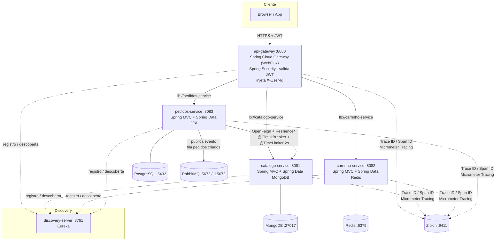

# DevCart — cobertura de teste não é eficácia de teste

**DevCart** é um e-commerce de referência em **microsserviços Java 21 / Spring Boot 3.4 / Spring Cloud 2023.x**
(catálogo, carrinho, pedidos, + gateway e service discovery).

O código funciona, mas o projeto existe para outra coisa: é o **laboratório de uma palestra** sobre
**barreiras de qualidade avançadas em CI/CD acelerado por IA**. Ele demonstra, rodando ao vivo, por que
"100 % de cobertura + SonarQube verde" **não** garante que o software está correto — e quais três gates
fecham essa lacuna: **teste de mutação**, **property-based testing** e **teste de contrato**.

Todo o conteúdo desta demonstração — a narrativa, os comandos e os **prompts de IA** usados para gerar
cada peça — está neste README, para que qualquer pessoa consiga **rodar e entender** o repositório sem
material externo.

---

## Índice

1. [A tese da palestra](#1-a-tese-da-palestra)
2. [Início rápido](#2-início-rápido)
3. [Arquitetura](#3-arquitetura)
4. [Stack](#4-stack)
5. [Como executar a aplicação](#5-como-executar-a-aplicação)
6. [Os 4 gates de qualidade](#6-os-4-gates-de-qualidade)
7. [Catálogo de testes — o que cada teste verifica](#7-catálogo-de-testes--o-que-cada-teste-verifica)
8. [Os 6 defeitos que os gates pegaram](#8-os-6-defeitos-que-os-gates-pegaram)
9. [Como os gates estão configurados no `pom`](#9-como-os-gates-estão-configurados-no-pom)
10. [Prompts de IA usados no projeto](#10-prompts-de-ia-usados-no-projeto)
11. [Módulos e endpoints](#11-módulos-e-endpoints)
12. [Contrato de erro padronizado](#12-contrato-de-erro-padronizado)
13. [Observabilidade](#13-observabilidade)
14. [Variáveis de ambiente](#14-variáveis-de-ambiente)
15. [Estrutura do repositório](#15-estrutura-do-repositório)
16. [Notas de compatibilidade](#16-notas-de-compatibilidade)

---

## 1. A tese da palestra

### O problema

Ferramentas de IA generativa (Copilot e afins) entraram no fluxo de desenvolvimento e moveram duas
métricas de forma visível:

- ↑ **velocidade** de escrita de código;
- ↑ **cobertura de testes** (Line / Branch) — o teste vem no mesmo commit da função.

O que **não** se move sozinho é a **taxa de defeito que escapa para produção**. O pipeline fica verde
mais rápido; não fica "mais certo" mais rápido. É o cenário do **falso positivo**: Pull Request verde,
cobertura 100 %, SonarQube 0 bugs — e bug de lógica ou quebra de contrato chegam à produção, elevando
**Change Failure Rate** e **MTTR**.

### Por que cobertura engana

| Métrica | O que realmente diz |
|---|---|
| **Line coverage** | esta linha foi *executada* por algum teste |
| **Branch coverage** | os dois lados de cada `if` foram *executados* |

Nenhuma das duas exige que **um `assert` tenha olhado o resultado**. Um teste que chama o método e
não verifica nada — ou verifica `isNotNull()` — conta 100 % igual a um teste forte. Cobertura é bom
detector de código **não testado**; é um certificado fraco de código **testado**.

### A resposta: 4 gates, cada um responde uma pergunta diferente

| # | Gate | Ferramenta | Pergunta que responde |
|---|---|---|---|
| 1 | **Cobertura** | JaCoCo + SonarQube | O código foi *executado* pelos testes? |
| 2 | **Mutação** | [PITest](https://pitest.org/) (≙ Stryker) | Um teste *falharia* se o código estivesse errado? |
| 3 | **Property-Based** | [jqwik](https://jqwik.net/) (≙ fast-check) | A regra vale para *todo* o domínio de entrada? |
| 4 | **Contrato** | [Pact JVM](https://docs.pact.io/) | Os microsserviços continuam *compatíveis*? |

> **Mutação encontra teste fraco. Property-based encontra especificação ausente. Contrato encontra
> quebra de integração.** As três medem **eficácia** — não execução.

### O que este repositório contém

O `pedidos-service` (o "motor de cálculo": valida quantidade/preço, soma o total, checa estoque) teve
**6 defeitos de fronteira** — o tipo de coisa que uma IA plausivelmente escreve com 100 % de cobertura.
Todos foram **encontrados pelos gates 2 e 3 e corrigidos**; as propriedades e o threshold de mutação
permanecem como **gate de regressão**. A seção [8](#8-os-6-defeitos-que-os-gates-pegaram) descreve
cada um: o que era, qual gate pegou, como foi corrigido.

---

## 2. Início rápido

```bash
# 1. Compilar + suíte unitária + gate de cobertura (JaCoCo 100 % linha/ramo por classe)
mvn clean verify
#    → BUILD SUCCESS · 87 testes · "All coverage checks have been met."

# 2. Gate de mutação (PITest) — pedidos-service
mvn -pl pedidos-service verify -Ppitest
#    → mutation score 100 % (47/47 mutantes mortos) · BUILD SUCCESS

# 3. Gate de property-based (jqwik) — pedidos-service
mvn -pl pedidos-service verify -Ppbt
#    → 48 testes (42 unitários + 6 propriedades) · BUILD SUCCESS

# 4. Gate de contrato (Pact JVM) — consumer + provider
mvn -pl pedidos-service test -Pcontract -Dtest=CatalogoContractTest
cp pedidos-service/target/pacts/*.json catalogo-service/src/test/resources/pacts/
mvn -pl catalogo-service test -Pcontract -Dtest=CatalogoProviderContractTest
#    → "Verifying a pact ... has status code 200 (OK) / has a matching body (OK)"

# Rodar a aplicação inteira (containers)
cp .env.example .env      # e ajuste JWT_SECRET
docker compose -f docker-compose.full.yml up -d --build
```

Pré-requisitos: **JDK 21**, **Maven 3.9+**, **Docker + Docker Compose**.

---

## 3. Arquitetura



### Decisões arquiteturais

| Padrão | Como é aplicado |
|---|---|
| **API Gateway** | `api-gateway` é o único ponto de entrada: roteamento, autenticação, propagação de identidade. As portas internas não são expostas fora da rede. |
| **Service Discovery** | Eureka. Todo roteamento é `lb://<serviço>` (client-side load balancing via Spring Cloud LoadBalancer). |
| **Database per Service** | MongoDB (catálogo), Redis (carrinho), PostgreSQL (pedidos). Nenhum serviço acessa o banco do outro. |
| **Segurança centralizada** | O JWT é validado **uma vez**, no gateway. Serviços internos confiam no header `X-User-Id` injetado pelo perímetro. |
| **Síncrono** | `pedidos-service` → `catalogo-service` via **OpenFeign** + Resilience4j (`@CircuitBreaker`, `@TimeLimiter` 2 s). |
| **Assíncrono** | `pedidos-service` publica `PedidoCriadoEvent` no RabbitMQ **após o commit** (`@TransactionalEventListener(AFTER_COMMIT)`). |
| **Camadas rígidas** | `model` (entidade, nunca exposta) → `repository` → `service` (regra de negócio, injeção só por construtor) → `controller` (DTOs `record` + `@Valid`). |
| **Erro padronizado** | Cada serviço tem um `@RestControllerAdvice` que devolve o mesmo envelope JSON. |
| **Observabilidade** | Micrometer Observation + Micrometer Tracing (Brave) → Zipkin; `traceId`/`spanId` propagados inclusive nas chamadas Feign. |

---

## 4. Stack

| Camada | Tecnologia |
|---|---|
| Runtime / build | **Java 21**, **Maven** multi-módulo (`spring-boot-starter-parent`) |
| Framework | **Spring Boot 3.4.1**, **Spring Cloud 2023.0.4** |
| Gateway / segurança | Spring Cloud Gateway (WebFlux) + Spring Security (OAuth2 Resource Server, JWT **HS256**) |
| Discovery | Spring Cloud Netflix Eureka |
| Persistência | Spring Data **MongoDB** · **Redis** · **JPA**/Hibernate + **PostgreSQL** |
| Síncrono / resiliência | **OpenFeign** + LoadBalancer · **Resilience4j** |
| Mensageria | **RabbitMQ** (Spring AMQP), fila `pedidos.criados` |
| Observabilidade | Micrometer Tracing (Brave) → **Zipkin** |
| Containerização | Docker multi-stage + Docker Compose |
| **Testes / qualidade** | **JUnit 5 + Mockito + AssertJ** · **JaCoCo** 0.8.15 · **SonarQube** · **PITest** 1.19.1 · **jqwik** 1.9.2 · **Pact JVM** 4.6.14 |

---

## 5. Como executar a aplicação

### Opção A — stack completa em containers (recomendado)

Sobe infraestrutura **+ os 5 microsserviços**:

```bash
cp .env.example .env          # defina JWT_SECRET (HS256, >= 32 bytes); ex.: openssl rand -base64 48
docker compose -f docker-compose.full.yml up -d --build
```

| Serviço | URL |
|---|---|
| API Gateway | http://localhost:8080 |
| Eureka | http://localhost:8761 |
| RabbitMQ (console) | http://localhost:15672 — `guest` / `guest` |
| Zipkin | http://localhost:9411 |

O `Dockerfile` da raiz é parametrizado por `--build-arg MODULE=<módulo>` (runtime `eclipse-temurin:21-jdk-alpine`).

### Opção B — infraestrutura em container, serviços na IDE

```bash
docker compose up -d --build          # mongodb, redis, postgres, rabbitmq, zipkin, discovery-server
export JWT_SECRET=$(openssl rand -base64 48)
mvn -pl catalogo-service spring-boot:run
mvn -pl carrinho-service spring-boot:run
mvn -pl pedidos-service  spring-boot:run
mvn -pl api-gateway      spring-boot:run
```

Os defaults dos `application.yml` (`localhost:27017/6379/5432/5672/9411`, Eureka em `:8761`) já batem
com esse compose. **`JWT_SECRET` não tem valor default no repositório** — o gateway exige a variável.

### Autenticação — gerar um JWT

Toda rota `/api/**` no gateway exige `Authorization: Bearer <JWT HS256>` **assinado com o
`JWT_SECRET` do seu `.env`**. Sem o header (ou com token de outro segredo / expirado) → `401`.
Liberadas apenas `OPTIONS` e `/actuator/health|info`. O gateway extrai a claim `sub` e injeta
`X-User-Id` internamente — o cliente **não** envia esse header.

O helper **`./mint-jwt.sh`** (raiz do repo) gera um token válido assinado com o `.env`:

```bash
export TOKEN=$(./mint-jwt.sh)          # sub=user-123, validade 24h
./mint-jwt.sh maria 1                  # sub=maria, validade 1h
```

> Precisa de `python3` (só a stdlib). O script lê `JWT_SECRET` de `.env` — nenhum segredo embutido.

### Exemplo de fluxo (via gateway)

```bash
export TOKEN=$(./mint-jwt.sh)

# 1. cadastra um produto  → guarde o "id" retornado
curl -s -X POST http://localhost:8080/api/catalogo/produtos \
  -H "Authorization: Bearer $TOKEN" -H 'Content-Type: application/json' \
  -d '{"nome":"Caneca DevCart","descricao":"350ml","preco":49.90,"estoque":10}'

# 2. adiciona ao carrinho
curl -s -X POST http://localhost:8080/api/carrinho/itens \
  -H "Authorization: Bearer $TOKEN" -H 'Content-Type: application/json' \
  -d '{"produtoId":"<id>","nome":"Caneca DevCart","quantidade":2,"precoUnitario":49.90}'

# 3. fecha o pedido — o preço e o nome vêm do catálogo via Feign (não do payload);
#    publica PedidoCriadoEvent em pedidos.criados após o commit
curl -s -X POST http://localhost:8080/api/pedidos \
  -H "Authorization: Bearer $TOKEN" -H 'Content-Type: application/json' \
  -d '{"itens":[{"produtoId":"<id>","quantidade":2}]}'
#    → { "id": 1, "status": "CRIADO", "valorTotal": 99.80, "itens": [...] }
```

---

## 6. Os 4 gates de qualidade

A **suíte base** é `JUnit 5 + Mockito + AssertJ`, **sem contexto Spring**, nas camadas `service` e
`model` dos três serviços de negócio. Os gates 2–4 ficam **fora da suíte padrão** (via
`@Tag` + `surefire.excludedGroups`); cada `-P<perfil>` libera o seu. Rodar `mvn verify` sem perfil =
só o gate 1.

Fora do escopo de cobertura (JaCoCo `excludes` + `sonar.coverage.exclusions`): `*Application`,
`controller/`, `client/`, `api-gateway`, `discovery-server`.

---

### Gate 1 — Cobertura (JaCoCo + SonarQube)

**Pergunta:** o código foi *executado* pelos testes?

```bash
mvn verify
```

```
Tests run: 87, Failures: 0, Errors: 0, Skipped: 0
[INFO] --- jacoco:0.8.15:check --- All coverage checks have been met.
[INFO] BUILD SUCCESS
```

- Relatório HTML por módulo: `<módulo>/target/site/jacoco/index.html`.
- Gate: `jacoco-maven-plugin` execução `check` no `verify`, elemento **CLASS**, `LINE` e `BRANCH` a
  **100 %** (contadores zerados — ex.: classe sem `if` — são ignorados).
- SonarQube (opcional):
  ```bash
  docker run -d --name devcart-sonar -p 9000:9000 -e SONAR_ES_BOOTSTRAP_CHECKS_DISABLE=true sonarqube:community
  # trocar a senha default e gerar um token em http://localhost:9000
  mvn -DskipTests verify sonar:sonar -Dsonar.token=SEU_TOKEN -Dsonar.projectKey=devcart
  ```
  `sonar.coverage.exclusions` no `pom` pai espelha os excludes do JaCoCo, então o dashboard também
  mostra 100 %.

> **Prompt usado**
> "Implemente o `pedidos-service` — valida quantidade e preço de cada item, soma o total do pedido,
> checa estoque no catálogo. Gere testes unitários com JUnit 5 + Mockito + AssertJ nas camadas
> `service` e `model`, cobrindo 100 % de linha e de ramo. Configure o gate de cobertura no JaCoCo."
> (idem para `catalogo-service` e `carrinho-service`.)

---

### Gate 2 — Teste de mutação (PITest)

**Pergunta:** um teste *falharia* se o código estivesse errado?

O PITest injeta pequenas faltas no **bytecode de produção** (`<` → `<=`, `+` → `-`,
`return x` → `return null`, remove chamada `void`…), roda a suíte contra cada versão e conta:
**mutante morto** (algum teste falhou — bom) vs **mutante sobrevivente** (a suíte inteira passou —
teste que não testa nada naquela linha). `mutation score = mortos / total`.

```bash
mvn -pl pedidos-service verify -Ppitest
```

```
>> Line Coverage (for mutated classes only): 132/132 (100%)
>> Generated 47 mutations Killed 47 (100%)
[INFO] BUILD SUCCESS
```

- Relatório HTML: `pedidos-service/target/pit-reports/index.html`.
- Escopo (`-Ppitest`): pacotes `model`, `service`, `dto`, `messaging` do `pedidos-service`; mutadores
  `DEFAULTS`; testes-alvo = suíte de exemplo (property e contract excluídos).
- **Gate:** `mutationThreshold` 100 % — *didático*. Em produção, use um **ratchet** (nunca deixar
  cair), não uma meta absoluta, por causa de mutantes equivalentes.
- No estado com os 6 defeitos, este gate ficava **vermelho** (44/45 = 98 %, 1 mutante sobrevivente em
  `ItemPedido` na guarda de fronteira `quantidade < 0`).

> **Prompt usado**
> "Adicione teste de mutação com PITest (`pitest-maven` + `pitest-junit5-plugin`) ao `pedidos-service`,
> como profile `-Ppitest`. Alvo: pacotes de domínio (`model`, `service`, `dto`, `messaging`). Mutadores
> `DEFAULTS`, relatório HTML + XML, e falhe o build se o mutation score ficar abaixo do threshold."

---

### Gate 3 — Property-Based Testing (jqwik)

**Pergunta:** a regra vale para *todo* o domínio de entrada?

Em vez de `entrada → saída esperada` (um caso escolhido a dedo), você declara um **invariante** que
tem de valer para qualquer entrada; o jqwik gera centenas de casos — incluindo os que a gente esquece
(`0`, `-1`, `MAX`, vazio, decimal de 30 casas) — tentando **quebrar**. Na falha, faz **shrinking**:
reduz ao *menor* input que ainda quebra.

```bash
mvn -pl pedidos-service verify -Ppbt
```

```
Tests run: 48, Failures: 0, Errors: 0, Skipped: 0   (42 unitários + 6 propriedades)
[INFO] BUILD SUCCESS
```

- Classes `*PropertyTest` com `@Tag("pbt")`, geradores `@Provide` (negativos, zero, decimais de escala
  30, inteiros grandes), `@Report(Reporting.FALSIFIED)` para imprimir o counterexample no shrinking.
- No estado com os 6 defeitos, este gate ficava **vermelho** com 6 counterexamples:

  | Property | Counterexample mínimo (shrink) |
  |---|---|
  | `quantidade ≤ 0` lança `IllegalArgumentException` | `quantidade = 0` |
  | preço negativo lança `IllegalArgumentException` | `preco = -1E-30` |
  | `recalcularTotal` é idempotente | `1×=1E-10` · `3×=3E-10` |
  | subtotal do DTO = preço × quantidade | preço `1E-20` → DTO devolve `2E-20` (q=2) |
  | `quantidadeItens` do evento = soma das linhas | 1 linha q=2 → evento diz `1` |
  | estoque validado pela soma do mesmo produto | `estoque=2`, pedido `[1, 2]` → aceito |

> **Prompt usado**
> "Crie testes de propriedade com jqwik para o motor de cálculo do pedido, marcados `@Tag(\"pbt\")`.
> Geradores `@Provide` com números negativos, zero, decimais de escala 30 e inteiros grandes.
> Propriedades: `valorTotal` nunca negativo nem NaN; `quantidade <= 0` sempre lança
> `IllegalArgumentException`; `subtotal == preço × quantidade`; `recalcularTotal` é idempotente.
> Use `@Report(FALSIFIED)` para exibir o counterexample no shrinking."

---

### Gate 4 — Teste de contrato (Pact JVM)

**Pergunta:** os microsserviços continuam *compatíveis*?

e2e real entre serviços é lento, instável e precisa de ambiente; integração com mock é rápida mas o
mock **desvia** da realidade ("passa nos mocks, quebra em produção"). **Consumer-Driven Contracts**:
o *consumer* declara o que precisa do *provider*; o *provider* roda a **resposta real** contra cada
interação, antes do deploy.

```bash
# 1. consumer descreve a expectativa e gera o pact
mvn -pl pedidos-service test -Pcontract -Dtest=CatalogoContractTest
#    → pedidos-service/target/pacts/pedidos-service-catalogo-service.json

# 2. "publica" o pact para o provider (aqui: cópia; em produção seria um Pact Broker)
cp pedidos-service/target/pacts/pedidos-service-catalogo-service.json \
   catalogo-service/src/test/resources/pacts/

# 3. provider verifica
mvn -pl catalogo-service test -Pcontract -Dtest=CatalogoProviderContractTest
```

```
Verifying a pact between pedidos-service and catalogo-service
  Given produto PROD-1 existe
  busca do produto PROD-1 pelo pedidos-service
    returns a response which
      has status code 200 (OK)
      has a matching body (OK)
```

- **Consumer** (`pedidos-service`): `client/CatalogoContractTest`, `@Tag("contract")`. Mock server do
  Pact + o `CatalogoFeignClient` **de produção** (via `SpringMvcContract`). O pact fixa **tipos**, não
  valores (`$.preco → decimal`, `$.estoque → integer`).
- **Provider** (`catalogo-service`): `contract/CatalogoProviderContractTest`, `@Tag("contract")`.
  `@SpringBootTest` em porta aleatória (MongoDB/Eureka desligados), `ProdutoService` **mockado** por
  `@State("produto PROD-1 existe")`; `@TestTemplate` replaya cada interação do pact.
- O pact é versionado em `catalogo-service/src/test/resources/pacts/`. Em produção, um **Pact Broker**
  guarda a matriz consumer × provider e o `can-i-deploy` barra o par incompatível.
- `mvn verify -Pcontract` roda o reator inteiro com os `@Tag("contract")` incluídos.

> **Prompt usado**
> "Implemente teste de contrato Pact JVM entre `pedidos-service` (consumer, `GET /produtos/{id}` via
> `CatalogoFeignClient`) e `catalogo-service` (provider), marcados `@Tag(\"contract\")`. Consumer:
> `pact-consumer-junit5` + mock server, matchers por tipo. Provider: `@SpringBootTest` em porta
> aleatória, `ProdutoService` mockado por `@State`. Gere o pact e verifique-o no provider."

---

## 7. Catálogo de testes — o que cada teste verifica

### `catalogo-service` — 22 testes unitários + 1 de contrato

| Classe | # | O que verifica |
|---|---|---|
| `service/ProdutoServiceTest` | 13 | `criar` (ok / nome duplicado → `ProdutoJaExisteException`), `listar` (mapeia todos / lista vazia), `buscarPorId` (ok / não encontrado), `atualizar` (altera e persiste; mantém o mesmo nome sem checar duplicidade; novo nome livre; novo nome tomado → conflito; id inexistente), `remover` (deleta / id inexistente). Mocka `ProdutoRepository`. |
| `model/ProdutoTest` | 3 | Construtor com todos os campos, setters, `ProdutoResponse.fromEntity` (mapeamento entidade → DTO). |
| `exception/GlobalExceptionHandlerTest` | 6 | Mapeamento de exceção → HTTP: `ProdutoNaoEncontrado` → 404, `ProdutoJaExiste` → 409, genérica → 500 com mensagem fixa, `MethodArgumentNotValid` → 400 concatenando os erros de campo, e o fallback de `resolvePath` (com e sem `RequestContextHolder`). |
| `contract/CatalogoProviderContractTest` | 1 (`@TestTemplate`) | Sobe o serviço real e verifica que a resposta de `GET /produtos/PROD-1` continua compatível com o pact publicado pelo `pedidos-service`. |

### `carrinho-service` — 23 testes unitários

| Classe | # | O que verifica |
|---|---|---|
| `service/CarrinhoServiceTest` | 12 | `adicionarItem` (carrinho novo; incrementa item existente e atualiza nome/preço; segundo produto distinto; excede limite 100 → `RegraNegocioException`; exatamente 100 é permitido; `trim` do usuário; usuário em branco/nulo → `UsuarioNaoInformadoException`), `listarCarrinho` (persistido / vazio quando não existe), `limparCarrinho` (delega `deleteById` com chave normalizada; usuário em branco). Mocka `CarrinhoRepository`. |
| `model/CarrinhoModelTest` | 5 | `ItemCarrinho.getSubtotal` (preço × quantidade) e setters; `Carrinho` getters/setters; `CarrinhoResponse.fromEntity` (agrega `quantidadeItens` e `valorTotal`; caso sem itens). |
| `exception/GlobalExceptionHandlerTest` | 6 | `X-User-Id` ausente / `UsuarioNaoInformadoException` → 400 com mensagem fixa; corpo malformado → 400; `RegraNegocioException` → 422; genérica → 500; validação → 400 concatenada. |

### `pedidos-service` — 42 testes unitários + 6 propriedades + 1 de contrato

**Unitários**

| Classe | # | O que verifica |
|---|---|---|
| `service/PedidoServiceTest` | 15 | `criarPedido`: caminho feliz (calcula total, persiste, publica `PedidoCriadoEvent`); soma de vários itens; usuário nulo/branco → `RegraNegocioException` (e nenhuma interação com colaboradores); estoque insuficiente / estoque `null` → `RegraNegocioException` (sem `save`); estoque == quantidade é aceito; falhas assíncronas do catálogo (`CatalogoIndisponivelException` e `RegraNegocioException` propagadas sem re-embrulhar; falha genérica → `CatalogoIndisponivelException` com `cause`); `buscarPorId` (ok / `PedidoNaoEncontradoException`); `listarPorUsuario` (normaliza o usuário, mapeia, vazio, branco). Mocka `PedidoRepository`, `CatalogoClientService`, `ApplicationEventPublisher`. |
| `model/PedidoModelTest` | 15 | `ItemPedido`: `getSubtotal`, aceita preço zero, construtor protegido do JPA, rejeita quantidade `<= 0` e preço nulo/negativo, `toString`. `Pedido`: `adicionarItem` vincula ao pedido, `recalcularTotal` (soma exata; zera sem itens), `getQuantidadeTotalItens`, `aoPersistir` define `criadoEm` só uma vez, `setStatus`, construtor protegido. `PedidoResponse.fromEntity` e `PedidoCriadoEvent.fromEntity`. `StatusPedido` com os 3 estados. |
| `exception/GlobalExceptionHandlerTest` | 7 | `PedidoNaoEncontrado` → 404, `RegraNegocio` → 422, `CatalogoIndisponivel` → 503, header ausente / corpo ilegível → 400, validação → 400 concatenada, genérica → 500. |
| `messaging/PedidoEventMessagingTest` | 2 | `PedidoEventPublisher` envia para a fila `pedidos.criados` no exchange default; `PedidoEventListener` delega ao publisher (após o commit). |
| `messaging/RabbitConfigTest` | 3 | Os `@Bean`: a fila é durável e com o nome esperado; o conversor é JSON; o `RabbitTemplate` usa o conversor injetado. |

**Propriedades (`@Tag("pbt")`, geradores `@Provide` com negativos / zero / decimais de escala 30 / inteiros grandes)**

| Classe | # | Invariante(s) |
|---|---|---|
| `model/ItemPedidoPropertyTest` | 2 | Toda `quantidade <= 0` dispara `IllegalArgumentException`; todo `preco < 0` dispara `IllegalArgumentException`. |
| `model/PedidoPropertyTest` | 1 | `recalcularTotal()` é **idempotente**: chamar N vezes = chamar 1 vez. |
| `dto/ItemPedidoResponsePropertyTest` | 1 | No DTO, `precoUnitario` == preço da entidade **e** `subtotal` == preço × quantidade (a suíte de exemplo, com q=1, não distinguia os dois campos). |
| `messaging/PedidoCriadoEventPropertyTest` | 1 | `evento.quantidadeItens` == **soma das quantidades** das linhas (não o número de linhas). |
| `service/PedidoServicePropertyTest` | 1 | Se a **soma** das quantidades de um mesmo produto excede o estoque, `criarPedido` lança `RegraNegocioException` (usa Mockito dentro da property para montar `PedidoService`). |

**Contrato**

| Classe | # | O que verifica |
|---|---|---|
| `client/CatalogoContractTest` | 1 | O `CatalogoFeignClient` de produção fala HTTP/JSON conforme o contrato esperado de `GET /produtos/{id}`; gera o pact. |

---

## 8. Os 6 defeitos que os gates pegaram

Cada um é uma falha de fronteira que a suíte de exemplo (100 % Line/Branch, Sonar sem bugs) **não
distinguia** — porque usava entradas "bem-comportadas" (quantidade `1`, preço não-negativo, produto
uma vez por pedido). Foram **encontrados pelos gates 2/3 e corrigidos**; o teste que os pega é o gate
de regressão.

| Classe | Defeito | Correção | Pego por |
|---|---|---|---|
| `ItemPedido` | guarda `quantidade < 0` (aceitava `0`) | `quantidade <= 0` | **PITest** (`ConditionalsBoundaryMutator` sobrevivente em `ItemPedido:44`) + **jqwik** (`quantidade = 0`) |
| `ItemPedido` | guarda de preço só checava `null` | `precoUnitario == null \|\| precoUnitario.signum() < 0` | **jqwik** (`preco = -1E-30`) |
| `Pedido` | `recalcularTotal()` acumulava (`this.valorTotal.add(...)`) | atribuição direta (reset) | **jqwik** (não idempotente) |
| `ItemPedidoResponse` | `fromEntity` trocava `precoUnitario` ↔ `subtotal` | ordem correta dos argumentos | **jqwik** (`q=2` distingue os campos) |
| `PedidoCriadoEvent` | `fromEntity` usava `getItens().size()` | `getQuantidadeTotalItens()` | **jqwik** (1 linha `q=2` → evento dizia `1`) |
| `PedidoService` | validava estoque **linha a linha** | consolida a quantidade por produto (`Map`) antes de validar | **jqwik** (`estoque=2`, pedido `[1, 2]` do mesmo produto → aceito) |

> **Prompt de correção usado**
> "O PITest acusou um mutante sobrevivente em `ItemPedido:44` (`ConditionalsBoundaryMutator`) e o
> jqwik falsificou 6 propriedades do domínio. Corrija os defeitos de lógica apontados sem quebrar a
> suíte unitária, e deixe as propriedades passando como gate de regressão."

---

## 9. Como os gates estão configurados no `pom`

### `pom.xml` (pai)

- **JaCoCo 0.8.15** — `prepare-agent`, `report` (fase `test`), `check` (fase `verify`, elemento
  `CLASS`, `LINE`+`BRANCH` = 1.00). `<excludes>`: `**/*Application.class`, `**/controller/**`,
  `**/client/**`, `com/devcart/apigateway/**`, `com/devcart/discoveryserver/**`.
- **maven-surefire-plugin** — `argLine` combina o agente do JaCoCo com
  `-Dnet.bytebuddy.experimental=true -XX:+EnableDynamicAgentLoading` (Mockito/ByteBuddy em JDK novo).
  `<excludedGroups>${surefire.excludedGroups}</excludedGroups>` — default `pbt,contract` (não rodam na
  suíte padrão).
- **maven-surefire-report-plugin** — `mvn surefire-report:report-only` gera
  `target/reports/surefire.html`.
- **sonar-maven-plugin** + propriedades `sonar.*` (`sonar.coverage.exclusions` espelha o JaCoCo).
- **Perfis:**
  | Perfil | Efeito |
  |---|---|
  | *(nenhum)* | `surefire.excludedGroups = pbt,contract` → só a suíte unitária + gate JaCoCo |
  | `-Ppbt` | `surefire.excludedGroups = contract` → unitários + `@Tag("pbt")` |
  | `-Pcontract` | `surefire.excludedGroups = pbt` → unitários + `@Tag("contract")` |

### `pedidos-service/pom.xml`

- Dependências de teste: `net.jqwik:jqwik`, `au.com.dius.pact.consumer:junit5`,
  `io.github.openfeign:feign-jackson`.
- Perfil **`pitest`** — `pitest-maven` + `pitest-junit5-plugin`, goal `mutationCoverage` na fase
  `verify`, `mutationThreshold` 100, `excludedGroups` `pbt`/`contract`,
  `excludedTestClasses` `**PropertyTest` / `**ContractTest`.

### `catalogo-service/pom.xml`

- Dependência de teste: `au.com.dius.pact.provider:junit5spring`.

---

## 10. Prompts de IA usados no projeto

Consolidado (os mesmos das seções acima). São prompts realistas, do tipo que se cola no Copilot Chat:

| # | Objetivo | Prompt |
|---|---|---|
| 1 | Serviço + suíte unitária + cobertura | *"Implemente o `<serviço>` — [regras de negócio]. Gere testes unitários com JUnit 5 + Mockito + AssertJ nas camadas `service` e `model`, cobrindo 100 % de linha e de ramo. Configure o gate de cobertura no JaCoCo."* |
| 2 | Teste de mutação | *"Adicione teste de mutação com PITest (`pitest-maven` + `pitest-junit5-plugin`) ao `pedidos-service`, como profile `-Ppitest`. Alvo: pacotes de domínio. Mutadores `DEFAULTS`, relatório HTML + XML, e falhe o build se o mutation score ficar abaixo do threshold."* |
| 3 | Property-based | *"Crie testes de propriedade com jqwik para o motor de cálculo do pedido, marcados `@Tag(\"pbt\")`. Geradores `@Provide` com negativos, zero, decimais de escala 30 e inteiros grandes. Propriedades: `valorTotal` nunca negativo/NaN; `quantidade <= 0` sempre lança `IllegalArgumentException`; `subtotal == preço × quantidade`; `recalcularTotal` é idempotente. Use `@Report(FALSIFIED)` para exibir o counterexample no shrinking."* |
| 4 | Contrato | *"Implemente teste de contrato Pact JVM entre `pedidos-service` (consumer, `GET /produtos/{id}` via `CatalogoFeignClient`) e `catalogo-service` (provider), marcados `@Tag(\"contract\")`. Consumer: `pact-consumer-junit5` + mock server, matchers por tipo. Provider: `@SpringBootTest` em porta aleatória, `ProdutoService` mockado por `@State`. Gere o pact e verifique-o no provider."* |
| 5 | Correção guiada pelos gates | *"O PITest acusou um mutante sobrevivente em `ItemPedido:44` (`ConditionalsBoundaryMutator`) e o jqwik falsificou 6 propriedades do domínio. Corrija os defeitos de lógica apontados sem quebrar a suíte unitária, e deixe as propriedades passando como gate de regressão."* |

> **Lição da palestra sobre os prompts:** escrever um *invariante* plausivelmente-errado é muito mais
> difícil do que escrever um *exemplo* plausivelmente-errado. Um exemplo errado passa despercebido;
> uma property errada falha no primeiro caso. Você revisa a *afirmação* (uma linha), não 500 casos
> gerados.

---

## 11. Módulos e endpoints

| Módulo | Porta | Dados | Responsabilidade |
|---|---|---|---|
| **discovery-server** | 8761 | — | Eureka Server (`@EnableEurekaServer`, não se registra nem busca registro) |
| **api-gateway** | 8080 | — | Roteamento `lb://`, validação de JWT, injeção de `X-User-Id` |
| **catalogo-service** | 8081 | MongoDB | CRUD de produtos |
| **carrinho-service** | 8082 | Redis | Carrinho por usuário (chave = `X-User-Id`) |
| **pedidos-service** | 8083 | PostgreSQL | Criação de pedidos, consulta ao catálogo (Feign), evento no RabbitMQ |

### `api-gateway`

Rotas (`application.yml`) — `StripPrefix` ajustado ao mapeamento de cada controller:

| Path externo | Destino | Filtro | Path repassado |
|---|---|---|---|
| `/api/catalogo/**` | `lb://catalogo-service` | `StripPrefix=2` | `/produtos/**` |
| `/api/carrinho/**` | `lb://carrinho-service` | `StripPrefix=1` | `/carrinho/**` |
| `/api/pedidos/**`  | `lb://pedidos-service`  | `StripPrefix=1` | `/pedidos/**` |

`SecurityConfig`: `@EnableWebFluxSecurity`, OAuth2 Resource Server com `ReactiveJwtDecoder` HMAC/HS256
(`security.jwt.secret` = `${JWT_SECRET}`, **sem default**). Tudo autenticado exceto `OPTIONS` e
`/actuator/health|info`. `JwtClaimsPropagationGlobalFilter`: remove `X-User-Id`/`X-User-Roles` vindos
do cliente (anti-spoofing), exige o token (senão `401` JSON), injeta `X-User-Id` (claim `sub`) e
`X-User-Roles` em toda requisição repassada.

### `catalogo-service`

`model/Produto` (`@Document`, índice único em `nome`) → `ProdutoRepository extends MongoRepository`
→ `ProdutoService` (regra de nome único) → `ProdutoController`.

| Método | Rota interna | Via gateway | Sucesso |
|---|---|---|---|
| `POST` | `/produtos` | `/api/catalogo/produtos` | `201` + `Location` |
| `GET` | `/produtos` · `/produtos/{id}` | `/api/catalogo/produtos[...]` | `200` |
| `PUT` | `/produtos/{id}` | `/api/catalogo/produtos/{id}` | `200` |
| `DELETE` | `/produtos/{id}` | `/api/catalogo/produtos/{id}` | `204` |

### `carrinho-service`

Carrinho resolvido pela chave `X-User-Id` (`@RequestHeader`; ausência/branco → `400`).
`model/Carrinho` (`@RedisHash`, `@Id usuarioId`, TTL 7 dias) + `ItemCarrinho` → `CarrinhoRepository`
→ `CarrinhoService`.

| Método | Rota interna | Via gateway | Descrição |
|---|---|---|---|
| `POST` | `/carrinho/itens` | `/api/carrinho/itens` | Adiciona item (soma se já existe; limite 100/produto → `422`) |
| `GET` | `/carrinho` | `/api/carrinho` | Retorna o carrinho (vazio se não existir) |
| `DELETE` | `/carrinho` | `/api/carrinho` | Limpa (`204`, idempotente) |

### `pedidos-service`

- **JPA:** `Pedido` (`@OneToMany` cascade/orphanRemoval, `status` enum, `valorTotal`, `criadoEm`) e
  `ItemPedido` (`@ManyToOne`; construtor **impõe** `quantidade > 0` e `preço >= 0`).
- **Síncrono (OpenFeign):** `CatalogoFeignClient` → `lb://catalogo-service`, encapsulado em
  `CatalogoClientService`:
  ```java
  @CircuitBreaker(name = "catalogo", fallbackMethod = "buscarProdutoFallback")
  @TimeLimiter(name = "catalogo")   // timeout estrito 2s
  public CompletableFuture<ProdutoDto> buscarProduto(String produtoId) { ... }
  ```
  Timeout / circuito aberto → `CatalogoIndisponivelException` → `503`.
- **Assíncrono (RabbitMQ):** após `pedidoRepository.save(...)`, um evento de domínio é publicado e o
  `PedidoEventListener` (`@TransactionalEventListener(AFTER_COMMIT)`) só então envia `PedidoCriadoEvent`
  (JSON) para a fila **`pedidos.criados`**. A mensagem só sai se o commit no PostgreSQL teve sucesso.
- **Regras:** estoque insuficiente → `422`; `X-User-Id` ausente → `422`. Preço **nunca** vem do
  cliente — é lido do catálogo na criação.

| Método | Rota interna | Via gateway | Descrição |
|---|---|---|---|
| `POST` | `/pedidos` | `/api/pedidos` | Cria pedido de `{ itens: [{ produtoId, quantidade }] }` |
| `GET` | `/pedidos/{id}` · `/pedidos` | `/api/pedidos[...]` | Busca por id · lista do `X-User-Id` |

---

## 12. Contrato de erro padronizado

Todos os serviços respondem erros com o mesmo envelope (`@RestControllerAdvice` + `record ApiError`):

```json
{
  "timestamp": "2026-08-30T12:34:56.789Z",
  "status": 422,
  "error": "Unprocessable Entity",
  "message": "Estoque insuficiente para o produto 64f0c1...",
  "path": "/pedidos"
}
```

| Situação | HTTP |
|---|---|
| Validação de payload / header `X-User-Id` ausente / corpo malformado | `400` |
| Recurso não encontrado | `404` |
| Conflito (nome de produto duplicado) | `409` |
| Regra de negócio violada (estoque, limite de carrinho) | `422` |
| Catálogo indisponível (timeout 2 s / circuito aberto) | `503` |
| Não tratado | `500` |

---

## 13. Observabilidade

- Herdado do `pom` pai por **todos** os módulos: `spring-boot-starter-actuator`,
  `micrometer-tracing-bridge-brave`, `zipkin-reporter-brave`. `pedidos-service` adiciona
  `feign-micrometer` para propagar o trace nas chamadas Feign.
- `application.yml`:
  ```yaml
  management:
    tracing:
      sampling:
        probability: 1.0
    zipkin:
      tracing:
        endpoint: ${MANAGEMENT_ZIPKIN_TRACING_ENDPOINT:http://localhost:9411/api/v2/spans}
  ```
- Um `POST /api/pedidos` gera um único **Trace ID** atravessando gateway → `pedidos-service` →
  (Feign) `catalogo-service`, visível em **http://localhost:9411**. Logs no formato
  `[<app>,<traceId>,<spanId>]`.

---

## 14. Variáveis de ambiente

| Variável | Usada por | Default | Descrição |
|---|---|---|---|
| `JWT_SECRET` | api-gateway | **obrigatória** (sem default) | Segredo HMAC/HS256, **≥ 32 bytes**. Ex.: `openssl rand -base64 48` |
| `JWT_ISSUER` | api-gateway | *(vazio)* | Issuer esperado no token (opcional) |
| `EUREKA_URI` | todos | `http://localhost:8761/eureka/` | Endpoint do Eureka |
| `MANAGEMENT_ZIPKIN_TRACING_ENDPOINT` | todos | `http://localhost:9411/api/v2/spans` | Coletor Zipkin |
| `MONGODB_URI` | catalogo-service | `mongodb://localhost:27017/catalogo` | Conexão MongoDB |
| `REDIS_HOST` / `REDIS_PORT` | carrinho-service | `localhost` / `6379` | Conexão Redis |
| `POSTGRES_URL` / `POSTGRES_USER` / `POSTGRES_PASSWORD` | pedidos-service | `jdbc:postgresql://localhost:5432/pedidos` / `pedidos` / `pedidos` | Conexão PostgreSQL |
| `RABBITMQ_HOST` / `RABBITMQ_PORT` / `RABBITMQ_USER` / `RABBITMQ_PASSWORD` | pedidos-service | `localhost` / `5672` / `guest` / `guest` | Conexão RabbitMQ |

`.env.example` → copie para `.env` (ignorado pelo git) e ajuste.

---

## 15. Estrutura do repositório

```
devcart/
├── pom.xml                     # POM pai: multi-módulo, deps de observabilidade, JaCoCo, Sonar,
│                               #          surefire (tags), perfis pbt/contract
├── .env.example                # variáveis (copie para .env)
├── mint-jwt.sh                  # gera um JWT HS256 assinado com o JWT_SECRET do .env
├── Dockerfile                  # multi-stage parametrizado (--build-arg MODULE=...)
├── docker-compose.yml          # infraestrutura + discovery-server
├── docker-compose.full.yml     # infraestrutura + os 5 microsserviços
├── discovery-server/           # Eureka Server (:8761)
├── api-gateway/                # Spring Cloud Gateway + Security + filtro X-User-Id (:8080)
├── catalogo-service/           # MongoDB (:8081)
│   └── src/
│       ├── main/java/.../{model,repository,service,controller,exception}
│       └── test/java/.../{service,model,exception,contract}   ← ProdutoServiceTest, ...,
│           resources/pacts/pedidos-service-catalogo-service.json   CatalogoProviderContractTest
├── carrinho-service/           # Redis (:8082)   — mesma forma; testes service/model/exception
└── pedidos-service/            # PostgreSQL (:8083)
    ├── pom.xml                 # + jqwik, Pact consumer, perfil pitest
    └── src/
        ├── main/java/.../{client,messaging,model,dto,repository,service,controller,exception}
        └── test/java/.../
            ├── service/    PedidoServiceTest, PedidoServicePropertyTest
            ├── model/      PedidoModelTest, ItemPedidoPropertyTest, PedidoPropertyTest
            ├── dto/        ItemPedidoResponsePropertyTest
            ├── messaging/  PedidoEventMessagingTest, RabbitConfigTest, PedidoCriadoEventPropertyTest
            ├── exception/  GlobalExceptionHandlerTest
            └── client/     CatalogoContractTest
```

> Os diretórios `apresentacao/` (slides, roteiro, PPT) e `demo/` (runbook da palestra) são **locais**
> e não versionados (`.gitignore`). Este README é a fonte única do conteúdo da demonstração.

---

## 16. Notas de compatibilidade

- **Spring Boot 3.4 + Spring Cloud 2023.0.x**: a matriz oficial recomenda Spring Cloud **2024.0.x**
  para o Boot 3.4. O *Spring Cloud Compatibility Verifier* aborta o boot nessa combinação, então todos
  os serviços trazem `spring.cloud.compatibility-verifier.enabled: false`. Funciona na prática
  (validado ponta a ponta); para ficar no range suportado, alinhe as versões no `pom` pai e remova o
  flag.
- **JWT HS256 (segredo simétrico)**. Para um provedor OAuth2/OIDC real, troque o `ReactiveJwtDecoder`
  por `withJwkSetUri(...)` / `spring.security.oauth2.resourceserver.jwt.jwk-set-uri`.
- **JDK 26 / ByteBuddy**: o `argLine` do surefire já passa `-Dnet.bytebuddy.experimental=true` e
  `-XX:+EnableDynamicAgentLoading`; o JaCoCo está em 0.8.15 (0.8.13 não instrumenta em JVM 26).

---

## Licença

Ver [LICENSE](LICENSE).
