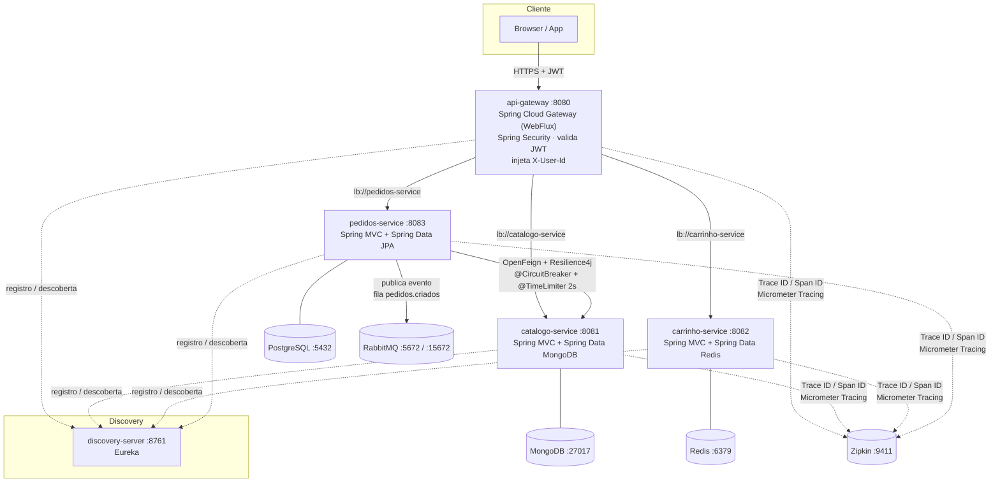

# DevCart

**DevCart** é um e-commerce de referência construído em **microsserviços Java 21 / Spring Boot 3.4+ / Spring Cloud 2023.x**.
O projeto é, antes de tudo, um **laboratório didático**: ele existe para demonstrar na prática *a ilusão dos "100% de cobertura de código" gerada por IA* — ou seja, como um conjunto de testes pode exibir cobertura altíssima e ainda assim não provar que o sistema está correto, resiliente ou fiel aos contratos entre serviços.

Para isso o domínio é propositalmente realista: catálogo, carrinho e pedidos, cada um com seu próprio banco (*Database per Service*), comunicação síncrona e assíncrona entre serviços, resiliência com circuit breaker/timeout, segurança centralizada com JWT e rastreamento distribuído.

---

## Objetivos

### Objetivo de produto
Simular um fluxo de compra ponta a ponta:

1. O catálogo publica produtos (nome, preço, estoque).
2. O cliente monta um carrinho vinculado à sua identidade.
3. O pedido é fechado: o serviço de pedidos **consulta o catálogo em tempo real** (preço/estoque), **persiste** o pedido e **publica um evento** para processamento assíncrono (pagamento, separação, notificação — fora do escopo atual).

### Objetivo didático (o foco real)
Servir de alvo para técnicas de teste que vão **além da cobertura de linha**:

| Técnica | Ferramenta | O que ataca |
|---|---|---|
| **Teste de mutação** | [PITest](https://pitest.org/) | Cobertura "verde" que não mata mutantes → asserts fracos, testes que só exercitam o código |
| **Property-based testing** | [jqwik](https://jqwik.net/) | Casos de borda que exemplos escolhidos a dedo não cobrem (valores negativos, coleções vazias, overflow de `BigDecimal`, etc.) |
| **Testes de contrato** | [Pact JVM](https://docs.pact.io/) | Integração entre `pedidos-service` (consumer) e `catalogo-service` (provider) que "passa" em mocks mas quebra em produção |

> **Status atual:** o esqueleto funcional dos 5 módulos + infraestrutura está pronto. As suítes PITest / jqwik / Pact ainda **não** foram adicionadas — são o próximo passo e a razão de ser do repositório.

---

## Arquitetura



### Padrões e decisões arquiteturais

| Padrão | Como é aplicado |
|---|---|
| **API Gateway** | `api-gateway` é o único ponto de entrada. Faz roteamento, autenticação e propagação de identidade. As portas dos serviços internos **não** devem ser expostas fora da rede. |
| **Service Discovery** | Eureka (`discovery-server`). Todo roteamento é `lb://<nome-do-serviço>` — client-side load balancing via Spring Cloud LoadBalancer. |
| **Database per Service** | MongoDB (catálogo), Redis (carrinho), PostgreSQL (pedidos). Nenhum serviço acessa o banco do outro. |
| **Segurança centralizada** | O JWT é validado **uma vez**, no gateway. Os serviços internos confiam no header `X-User-Id` assinado pelo perímetro. |
| **Comunicação síncrona** | `pedidos-service` → `catalogo-service` via **OpenFeign** (RestTemplate é proibido no projeto), com resiliência Resilience4j. |
| **Comunicação assíncrona** | `pedidos-service` publica `PedidoCriadoEvent` no RabbitMQ **após o commit** da transação (`@TransactionalEventListener(AFTER_COMMIT)`). |
| **Camadas rígidas** | `model` (entidade, nunca exposta) → `repository` → `service` (regras de negócio, injeção só por construtor) → `controller` (DTOs + `@Valid`). |
| **DTOs como Java Records** | Toda entrada/saída HTTP é `record`. Entidades JPA/Mongo/Redis nunca trafegam na API. |
| **Erro padronizado** | Todo serviço tem um `@RestControllerAdvice` que devolve o mesmo envelope JSON (`timestamp, status, error, message, path`). |
| **Observabilidade** | Micrometer Observation + Micrometer Tracing (bridge Brave) → Zipkin. `traceId`/`spanId` propagados entre gateway, serviços e chamadas Feign. |

---

## Stack e ferramentas

| Camada | Tecnologia |
|---|---|
| Linguagem / runtime | **Java 21** (LTS) |
| Framework | **Spring Boot 3.4.1**, **Spring Cloud 2023.0.4** |
| Build | **Maven** (multi-módulo, `pom.xml` pai com `spring-boot-starter-parent`) |
| Gateway | Spring Cloud Gateway (reativo / WebFlux) |
| Segurança | Spring Security + OAuth2 Resource Server (JWT **HS256**) |
| Service Discovery | Spring Cloud Netflix Eureka |
| Persistência | Spring Data **MongoDB** · Spring Data **Redis** · Spring Data **JPA** + Hibernate + **PostgreSQL** |
| Comunicação síncrona | **Spring Cloud OpenFeign** + Spring Cloud LoadBalancer |
| Resiliência | **Resilience4j** (`@CircuitBreaker`, `@TimeLimiter` — timeout estrito de 2 s) |
| Mensageria | **RabbitMQ** (Spring AMQP) — fila `pedidos.criados` |
| Observabilidade | Micrometer Observation, Micrometer Tracing (Brave), `zipkin-reporter-brave`, **Zipkin** |
| Validação | Jakarta Bean Validation (`@Valid`, `@NotNull`, `@NotBlank`, `@Positive`, …) |
| Containerização | Docker (multi-stage, runtime `eclipse-temurin:21-jdk-alpine`) + Docker Compose |
| **Testes (planejado)** | JUnit 5, **PITest** (mutação), **jqwik** (property-based), **Pact JVM** (contratos) |

---

## Módulos

| Módulo | Porta | Stack de dados | Responsabilidade |
|---|---|---|---|
| **discovery-server** | 8761 | — | Eureka Server (`@EnableEurekaServer`, `registerWithEureka=false`, `fetchRegistry=false`) |
| **api-gateway** | 8080 | — | Roteamento `lb://`, validação de JWT, injeção de `X-User-Id` |
| **catalogo-service** | 8081 | MongoDB | CRUD de produtos |
| **carrinho-service** | 8082 | Redis | Carrinho por usuário (chave = `X-User-Id`) |
| **pedidos-service** | 8083 | PostgreSQL | Criação de pedidos, consulta ao catálogo (Feign), evento no RabbitMQ |

### `discovery-server`
Eureka Server standalone. Não se registra nem busca registro. É a primeira dependência a subir.

### `api-gateway`
- **Rotas** (`application.yml`) — o `StripPrefix` é ajustado ao mapeamento de cada controller:
  | Path externo | Destino | Filtro | Path repassado |
  |---|---|---|---|
  | `/api/catalogo/**` | `lb://catalogo-service` | `StripPrefix=2` | `/produtos/**` |
  | `/api/carrinho/**` | `lb://carrinho-service` | `StripPrefix=1` | `/carrinho/**` |
  | `/api/pedidos/**`  | `lb://pedidos-service`  | `StripPrefix=1` | `/pedidos/**` |
- **Segurança** (`SecurityConfig`): `@EnableWebFluxSecurity`, OAuth2 Resource Server com `ReactiveJwtDecoder` HMAC/HS256 (segredo em `security.jwt.secret`). Tudo autenticado, exceto `OPTIONS` e `/actuator/health|info`. Claims `scope`/`scp` → `SCOPE_*`, claim `roles` → `ROLE_*`.
- **Filtro global** (`JwtClaimsPropagationGlobalFilter`, `GlobalFilter`):
  1. Remove `X-User-Id` / `X-User-Roles` recebidos do cliente (anti-spoofing).
  2. Lê o `JwtAuthenticationToken` do contexto reativo; sem token → `401` JSON.
  3. Injeta `X-User-Id` (claim configurável, default `sub`) e `X-User-Roles` em **toda** requisição repassada.

### `catalogo-service`
Camadas: `model/Produto` (`@Document`, com índice único em `nome`, **nunca** exposta) → `repository/ProdutoRepository extends MongoRepository` → `service/ProdutoService` (`@Service`, injeção por construtor, regra de nome único) → `controller/ProdutoController` (`@RestController`, `@Valid`).
DTOs: `ProdutoRequest` (record, validado), `ProdutoResponse` (record).

| Método | Rota (interna) | Via gateway | Sucesso |
|---|---|---|---|
| `POST` | `/produtos` | `/api/catalogo/produtos` | `201` + `Location` |
| `GET` | `/produtos` | `/api/catalogo/produtos` | `200` |
| `GET` | `/produtos/{id}` | `/api/catalogo/produtos/{id}` | `200` |
| `PUT` | `/produtos/{id}` | `/api/catalogo/produtos/{id}` | `200` |
| `DELETE` | `/produtos/{id}` | `/api/catalogo/produtos/{id}` | `204` |

### `carrinho-service`
O carrinho é sempre resolvido pela chave do usuário, **obrigatoriamente** vinda do header `X-User-Id` (`@RequestHeader`). Ausência/branco → `400`.
`model/Carrinho` (`@RedisHash`, `@Id usuarioId`, TTL 7 dias) + `ItemCarrinho` (POJO aninhado) → `repository/CarrinhoRepository extends CrudRepository` → `service/CarrinhoService` (`@Service`, construtor). DTOs **somente records**: `AdicionarItemRequest`, `ItemResponse`, `CarrinhoResponse` (com `valorTotal` e `quantidadeItens`).

| Método | Rota (interna) | Via gateway | Descrição |
|---|---|---|---|
| `POST` | `/carrinho/itens` | `/api/carrinho/itens` | Adiciona item (soma quantidade se já existe; limite 100/produto → `422`) |
| `GET` | `/carrinho` | `/api/carrinho` | Retorna o carrinho (vazio se não existir) |
| `DELETE` | `/carrinho` | `/api/carrinho` | Limpa o carrinho (`204`, idempotente) |

### `pedidos-service`
- **Modelos JPA**: `Pedido` (`@Entity`, `@OneToMany` cascade/orphanRemoval, `status` enum, `valorTotal`, `criadoEm`) e `ItemPedido` (`@ManyToOne`). DTOs records: `CriarPedidoRequest`, `ItemPedidoRequest`, `PedidoResponse`, `ItemPedidoResponse`.
- **Comunicação síncrona (OpenFeign)**: `CatalogoFeignClient` (`@FeignClient(name = "catalogo-service")` → resolvido como `lb://catalogo-service`). Encapsulado em `CatalogoClientService`:
  ```java
  @CircuitBreaker(name = "catalogo", fallbackMethod = "buscarProdutoFallback")
  @TimeLimiter(name = "catalogo")
  public CompletableFuture<ProdutoDto> buscarProduto(String produtoId) { ... }
  ```
  `timeout-duration: 2s` (estrito). Timeout / circuito aberto → `CatalogoIndisponivelException` → `503`.
- **Comunicação assíncrona (RabbitMQ)**: após `pedidoRepository.save(...)`, um evento de domínio é publicado e o `PedidoEventListener` (`@TransactionalEventListener(phase = AFTER_COMMIT)`) só então envia `PedidoCriadoEvent` (JSON) para a fila **`pedidos.criados`** (durável, exchange default). Garante que a mensagem só sai se o commit no PostgreSQL teve sucesso.
- **Regras**: estoque insuficiente → `422`; `X-User-Id` ausente → `422`. Preço **nunca** vem do cliente — é lido do catálogo no momento da criação.

| Método | Rota (interna) | Via gateway | Descrição |
|---|---|---|---|
| `POST` | `/pedidos` | `/api/pedidos` | Cria pedido a partir de `{ itens: [{ produtoId, quantidade }] }` |
| `GET` | `/pedidos/{id}` | `/api/pedidos/{id}` | Busca por id |
| `GET` | `/pedidos` | `/api/pedidos` | Lista pedidos do `X-User-Id` |

---

## Contrato de erro padronizado

Todos os serviços respondem erros com o mesmo envelope (`@RestControllerAdvice` + `record ApiError`):

```json
{
  "timestamp": "2026-08-30T12:34:56.789Z",
  "status": 422,
  "error": "Unprocessable Entity",
  "message": "Estoque insuficiente para o produto 64f0c1...",
  "path": "/pedidos"
}
```

| Situação | HTTP |
|---|---|
| Validação de payload (`MethodArgumentNotValidException`) | `400` |
| Header `X-User-Id` ausente / corpo malformado | `400` |
| Recurso não encontrado | `404` |
| Conflito (nome de produto duplicado) | `409` |
| Regra de negócio violada (estoque, limite de carrinho) | `422` |
| Catálogo indisponível (timeout 2 s / circuito aberto) | `503` |
| Não tratado | `500` |

---

## Observabilidade — rastreamento distribuído

- Dependências herdadas do `pom.xml` pai por **todos** os módulos: `spring-boot-starter-actuator`, `micrometer-tracing-bridge-brave`, `zipkin-reporter-brave`. `pedidos-service` adiciona `feign-micrometer` para propagar o trace nas chamadas Feign.
- Configuração (em cada `application.yml`):
  ```yaml
  management:
    tracing:
      sampling:
        probability: 1.0
    zipkin:
      tracing:
        endpoint: ${MANAGEMENT_ZIPKIN_TRACING_ENDPOINT:http://localhost:9411/api/v2/spans}
  ```
- Resultado: um `POST /api/pedidos` gera um único **Trace ID** que atravessa gateway → `pedidos-service` → (Feign) `catalogo-service`, com os **Span IDs** de cada etapa visíveis em **http://localhost:9411**. Os logs saem no formato `[<app>,<traceId>,<spanId>]`.

---

## Como executar

### Pré-requisitos
- Docker + Docker Compose (para o caminho containerizado)
- JDK 21 e Maven 3.9+ (para rodar localmente)

### Opção A — stack completa em containers (recomendado)
Sobe infraestrutura **+ os 5 microsserviços**:

```bash
docker compose -f docker-compose.full.yml up -d --build
```

| Serviço | URL |
|---|---|
| API Gateway | http://localhost:8080 |
| Eureka | http://localhost:8761 |
| RabbitMQ (console) | http://localhost:15672 — `guest` / `guest` |
| Zipkin | http://localhost:9411 |

O `Dockerfile` da raiz é parametrizado por `--build-arg MODULE=<módulo>` (imagem de runtime `eclipse-temurin:21-jdk-alpine`). O primeiro build baixa as dependências Maven; rebuilds usam cache de `/root/.m2` (BuildKit).

### Opção B — só a infraestrutura + discovery em container, serviços na IDE
```bash
docker compose up -d --build          # mongodb, redis, postgres, rabbitmq, zipkin, discovery-server
mvn -pl catalogo-service spring-boot:run
mvn -pl carrinho-service spring-boot:run
mvn -pl pedidos-service  spring-boot:run
mvn -pl api-gateway      spring-boot:run
```
Os defaults dos `application.yml` (`localhost:27017/6379/5432/5672/9411`, `EUREKA_URI=http://localhost:8761`) já batem com esse compose.

### Build / verificação
```bash
mvn clean verify        # compila os 5 módulos (reactor)
```

---

## Exemplo de fluxo (via gateway)

> Todas as chamadas passam pelo gateway e exigem `Authorization: Bearer <JWT HS256>` assinado com o mesmo segredo de `security.jwt.secret`. O gateway extrai a claim `sub` e injeta `X-User-Id` internamente — o cliente **não** envia esse header.

```bash
TOKEN="eyJhbGciOiJIUzI1NiJ9..."          # JWT com claim "sub": "user-123"

# 1. cadastra um produto
curl -s -X POST http://localhost:8080/api/catalogo/produtos \
  -H "Authorization: Bearer $TOKEN" -H 'Content-Type: application/json' \
  -d '{"nome":"Caneca DevCart","descricao":"350ml","preco":49.90,"estoque":10}'

# 2. adiciona ao carrinho
curl -s -X POST http://localhost:8080/api/carrinho/itens \
  -H "Authorization: Bearer $TOKEN" -H 'Content-Type: application/json' \
  -d '{"produtoId":"<id>","nome":"Caneca DevCart","quantidade":2,"precoUnitario":49.90}'

# 3. fecha o pedido (consulta catálogo via Feign + publica evento em pedidos.criados)
curl -s -X POST http://localhost:8080/api/pedidos \
  -H "Authorization: Bearer $TOKEN" -H 'Content-Type: application/json' \
  -d '{"itens":[{"produtoId":"<id>","quantidade":2}]}'
```

---

## Variáveis de ambiente

| Variável | Usada por | Default | Descrição |
|---|---|---|---|
| `EUREKA_URI` | todos | `http://localhost:8761/eureka/` | Endpoint do Eureka |
| `MANAGEMENT_ZIPKIN_TRACING_ENDPOINT` | todos | `http://localhost:9411/api/v2/spans` | Coletor Zipkin |
| `JWT_SECRET` | api-gateway | segredo de dev | Segredo HMAC/HS256 (**≥ 32 bytes**, trocar em produção) |
| `JWT_ISSUER` | api-gateway | *(vazio)* | Issuer esperado no token (opcional) |
| `MONGODB_URI` | catalogo-service | `mongodb://localhost:27017/catalogo` | Conexão MongoDB |
| `REDIS_HOST` / `REDIS_PORT` | carrinho-service | `localhost` / `6379` | Conexão Redis |
| `POSTGRES_URL` / `POSTGRES_USER` / `POSTGRES_PASSWORD` | pedidos-service | `jdbc:postgresql://localhost:5432/pedidos` / `pedidos` / `pedidos` | Conexão PostgreSQL |
| `RABBITMQ_HOST` / `RABBITMQ_PORT` / `RABBITMQ_USER` / `RABBITMQ_PASSWORD` | pedidos-service | `localhost` / `5672` / `guest` / `guest` | Conexão RabbitMQ |

---

## Estrutura do repositório

```
devcart/
├── pom.xml                     # POM pai (multi-módulo, deps de observabilidade herdadas)
├── Dockerfile                  # multi-stage parametrizado (--build-arg MODULE=...)
├── docker-compose.yml          # infraestrutura + discovery-server
├── docker-compose.full.yml     # infraestrutura + os 5 microsserviços
├── discovery-server/           # Eureka Server (:8761) + Dockerfile próprio
├── api-gateway/                # Spring Cloud Gateway + Security + filtro X-User-Id (:8080)
│   └── src/main/java/com/devcart/apigateway/
│       ├── config/{SecurityConfig, JwtProperties}
│       └── filter/JwtClaimsPropagationGlobalFilter
├── catalogo-service/           # MongoDB (:8081) — model/dto/repository/service/controller/exception
├── carrinho-service/           # Redis   (:8082) — idem
└── pedidos-service/            # PostgreSQL (:8083)
    └── src/main/java/com/devcart/pedidosservice/
        ├── client/    (CatalogoFeignClient, CatalogoClientService)
        ├── messaging/ (RabbitConfig, PedidoCriadoEvent, PedidoEventPublisher, PedidoEventListener)
        ├── model/ dto/ repository/ service/ controller/ exception/
```

---

## Estratégia de testes (roadmap)

O código é o "paciente"; os testes são o experimento. A ideia é, para cada serviço:

1. Escrever testes tradicionais até atingir cobertura de linha ~100 % (JaCoCo).
2. Rodar **PITest** e mostrar o *mutation score* real — tipicamente muito abaixo de 100 %.
3. Introduzir **jqwik** para propriedades (ex.: "o `valorTotal` do pedido é sempre a soma dos subtotais", "adicionar e remover N itens devolve o carrinho ao estado inicial").
4. Introduzir **Pact JVM** entre `pedidos-service` (consumer) e `catalogo-service` (provider) e provocar uma quebra de contrato que os testes de unidade com mock não detectam.

> Nada disso está commitado ainda — os módulos hoje contêm apenas o `spring-boot-starter-test`. Contribuições nessa direção são o objetivo do projeto.

---

## Notas de compatibilidade

- **Spring Boot 3.4 + Spring Cloud 2023.0.x**: combinação usada aqui a pedido do projeto. A matriz oficial recomenda Spring Cloud **2024.0.x** para o Boot 3.4 (ou Boot 3.3.x para o Cloud 2023.0.x). O *Spring Cloud Compatibility Verifier* **aborta o boot** nessa combinação, então todos os serviços trazem `spring.cloud.compatibility-verifier.enabled: false` no `application.yml`. Funciona na prática (validado com o fluxo ponta a ponta); para ficar dentro do range suportado, alinhe as versões no `pom.xml` pai e remova o flag.
- O JWT é validado com **segredo simétrico (HS256)**. Para um provedor OAuth2/OIDC real, troque o `ReactiveJwtDecoder` por `withJwkSetUri(...)` / `spring.security.oauth2.resourceserver.jwt.jwk-set-uri`.

---

## Licença

Ver [LICENSE](LICENSE).
