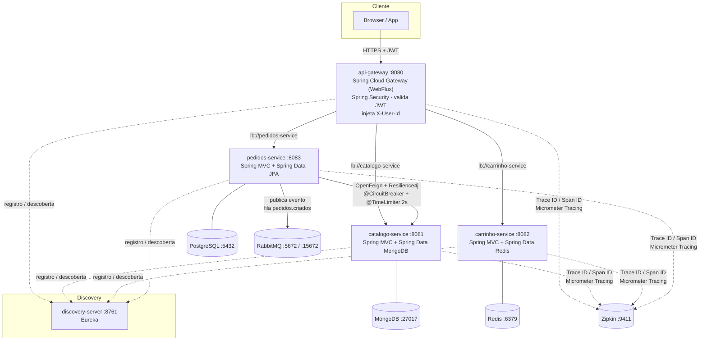

# DevCart — cobertura de teste não é eficácia de teste

**DevCart** é um e-commerce de referência em **microsserviços Java 21 / Spring Boot 3.4 / Spring Cloud 2023.x**
(catálogo, carrinho, pedidos, + gateway e service discovery).

O código funciona, mas o projeto existe para outra coisa: é o **laboratório da palestra
"Barreiras de Qualidade Avançadas em CI/CD acelerado por IA"**, apresentada no **TDC**
(The Developer's Conference). Ele demonstra, rodando de verdade, por que "100 % de cobertura +
SonarQube verde" **não** garante que o software está correto — e quais três gates fecham essa lacuna:
**teste de mutação**, **property-based testing** e **teste de contrato**.

Se você assistiu à palestra, aqui está tudo para refazer a demonstração na sua máquina: os slides, um
guia passo a passo, os prompts de IA usados, as perguntas e respostas da sessão e uma explicação de
cada ferramenta. Se não assistiu, este README é autossuficiente — comece pela
[tese](#1-a-tese-da-palestra) e pelos [conceitos](#4-conceitos-e-ferramentas).

> **Atalho:** slides e guia da demonstração estão na pasta [`TDC/`](TDC/). Para reproduzir os gates
> ficando vermelhos, siga [`TDC/COMANDOS.md`](TDC/COMANDOS.md).

---

## Índice

1. [A tese da palestra](#1-a-tese-da-palestra)
2. [Material da palestra (pasta `TDC/`)](#2-material-da-palestra-pasta-tdc)
3. [Início rápido](#3-início-rápido)
4. [Conceitos e ferramentas](#4-conceitos-e-ferramentas)
5. [Arquitetura](#5-arquitetura)
6. [Stack](#6-stack)
7. [Como executar a aplicação](#7-como-executar-a-aplicação)
8. [Os 4 gates de qualidade](#8-os-4-gates-de-qualidade)
9. [Catálogo de testes — o que cada teste verifica](#9-catálogo-de-testes--o-que-cada-teste-verifica)
10. [Os 6 defeitos que os gates pegaram](#10-os-6-defeitos-que-os-gates-pegaram)
11. [Como os gates estão configurados no `pom`](#11-como-os-gates-estão-configurados-no-pom)
12. [Prompts de IA usados no projeto](#12-prompts-de-ia-usados-no-projeto)
13. [Perguntas e respostas (Q&A)](#13-perguntas-e-respostas-qa)
14. [Módulos e endpoints](#14-módulos-e-endpoints)
15. [Contrato de erro padronizado](#15-contrato-de-erro-padronizado)
16. [Observabilidade](#16-observabilidade)
17. [Variáveis de ambiente](#17-variáveis-de-ambiente)
18. [Estrutura do repositório](#18-estrutura-do-repositório)
19. [Notas de compatibilidade](#19-notas-de-compatibilidade)

---

## 1. A tese da palestra

### O problema

Ferramentas de IA generativa (Copilot e afins) entraram no fluxo de desenvolvimento e moveram duas
métricas de forma visível:

- ↑ **velocidade** de escrita de código;
- ↑ **cobertura de testes** (Line / Branch) — o teste vem no mesmo commit da função.

O que **não** se move sozinho é a **taxa de defeito que escapa para produção**. O pipeline fica verde
mais rápido; não fica "mais certo" mais rápido. É o cenário do **falso positivo**: Pull Request verde,
cobertura 100 %, SonarQube 0 bugs — e bug de lógica ou quebra de contrato chegam à produção, elevando
**Change Failure Rate** e **MTTR**.

### Por que cobertura engana

| Métrica | O que realmente diz |
|---|---|
| **Line coverage** | esta linha foi *executada* por algum teste |
| **Branch coverage** | os dois lados de cada `if` foram *executados* |

Nenhuma das duas exige que **um `assert` tenha olhado o resultado**. Um teste que chama o método e
não verifica nada — ou verifica `isNotNull()` — conta 100 % igual a um teste forte. Cobertura é bom
detector de código **não testado**; é um certificado fraco de código **testado**.

### A resposta: 4 gates, cada um responde uma pergunta diferente

| # | Gate | Ferramenta | Pergunta que responde |
|---|---|---|---|
| 1 | **Cobertura** | JaCoCo + SonarQube | O código foi *executado* pelos testes? |
| 2 | **Mutação** | [PITest](https://pitest.org/) (≙ Stryker) | Um teste *falharia* se o código estivesse errado? |
| 3 | **Property-Based** | [jqwik](https://jqwik.net/) (≙ fast-check) | A regra vale para *todo* o domínio de entrada? |
| 4 | **Contrato** | [Pact JVM](https://docs.pact.io/) | Os microsserviços continuam *compatíveis*? |

> **Mutação encontra teste fraco. Property-based encontra especificação ausente. Contrato encontra
> quebra de integração.** As três medem **eficácia** — não execução.

### O que este repositório contém

O `pedidos-service` (o "motor de cálculo": valida quantidade/preço, soma o total, checa estoque) teve
**6 defeitos de fronteira** — o tipo de coisa que uma IA plausivelmente escreve com 100 % de cobertura.
Todos foram **encontrados pelos gates 2 e 3 e corrigidos**; as propriedades e o threshold de mutação
permanecem como **gate de regressão**. A seção [10](#10-os-6-defeitos-que-os-gates-pegaram) descreve
cada um: o que era, qual gate pegou, como foi corrigido — e o guia
[`TDC/COMANDOS.md`](TDC/COMANDOS.md) mostra como reintroduzi-los para ver os gates ficarem vermelhos.

---

## 2. Material da palestra (pasta `TDC/`)

| Arquivo | Conteúdo |
|---|---|
| [`TDC/Dani Cavalcanti-palestra.pptx`](TDC/Dani%20Cavalcanti-palestra.pptx) | Os slides apresentados: a tese, os 4 gates, os prompts que geraram cada peça e o resultado esperado de cada etapa da demonstração. |
| [`TDC/COMANDOS.md`](TDC/COMANDOS.md) | Guia passo a passo para refazer a demonstração: como colocar o código no estado "regressão" (com os 6 defeitos), rodar cada gate, ler o resultado, corrigir e — de bônus — quebrar um contrato de propósito para ver o Pact barrar. |

A sequência da demonstração, em uma linha:

```
regressão → gate 1 (verde!) → gate 2 (1 mutante vivo) → gate 3 (6 contraexemplos) → corrigido → gates 2 e 3 verdes → gate 4 (contrato)
```

---

## 3. Início rápido

```bash
# 1. Compilar + suíte unitária + gate de cobertura (JaCoCo 100 % linha/ramo por classe)
mvn clean verify
#    → BUILD SUCCESS · 87 testes · "All coverage checks have been met."

# 2. Gate de mutação (PITest) — pedidos-service
mvn -pl pedidos-service verify -Ppitest
#    → mutation score 100 % (47/47 mutantes mortos) · BUILD SUCCESS

# 3. Gate de property-based (jqwik) — pedidos-service
mvn -pl pedidos-service verify -Ppbt
#    → 48 testes (42 unitários + 6 propriedades) · BUILD SUCCESS

# 4. Gate de contrato (Pact JVM) — consumer + provider
mvn -pl pedidos-service test -Pcontract -Dtest=CatalogoContractTest
cp pedidos-service/target/pacts/*.json catalogo-service/src/test/resources/pacts/
mvn -pl catalogo-service test -Pcontract -Dtest=CatalogoProviderContractTest
#    → "Verifying a pact ... has status code 200 (OK) / has a matching body (OK)"

# Rodar a aplicação inteira (containers)
cp .env.example .env      # e ajuste JWT_SECRET
docker compose -f docker-compose.full.yml up -d --build
```

Pré-requisitos: **JDK 21**, **Maven 3.9+**, **Docker + Docker Compose** (este último só para subir a
aplicação — os gates não precisam de nenhum serviço no ar).

Os comandos acima rodam sobre o código **corrigido**, então todos os gates ficam verdes. Para ver o
cenário da palestra — gate 1 verde e gates 2 e 3 vermelhos com os 6 defeitos — siga
[`TDC/COMANDOS.md`](TDC/COMANDOS.md).

---

## 4. Conceitos e ferramentas

Esta seção explica, do zero, cada técnica e ferramenta de qualidade usada no projeto — o que é, por que
existe e como aparece aqui. Se você já conhece alguma, pule direto para a próxima.

### 4.1 A base: teste unitário com JUnit 5, Mockito e AssertJ

| Ferramenta | O que é | Como é usada aqui |
|---|---|---|
| **[JUnit 5](https://junit.org/junit5/)** (Jupiter) | O framework de testes padrão da JVM. Na versão 5, é uma *plataforma* (JUnit Platform) sobre a qual rodam vários *engines* — o próprio Jupiter, o jqwik, o Pact. | Toda a suíte. `@Tag("pbt")` e `@Tag("contract")` separam os testes avançados da suíte padrão. |
| **[Mockito](https://site.mockito.org/)** | Biblioteca de *test doubles*: cria objetos falsos (mocks) para isolar a classe sob teste das dependências (repositório, cliente HTTP, fila). | Os testes de `service` mockam `Repository`, `CatalogoClientService` e `ApplicationEventPublisher` — por isso a suíte roda **sem contexto Spring**, em segundos. |
| **[AssertJ](https://assertj.github.io/doc/)** | Biblioteca de asserções fluentes (`assertThat(x).isEqualByComparingTo("10.00")`). | Todas as verificações. `isEqualByComparingTo` é usado com `BigDecimal` para comparar valor, não escala. |

> **Por que isso importa para a palestra:** a IA escreve esse tipo de teste muito bem e muito rápido.
> O problema não é *ter* testes — é que um teste pode executar o código sem verificar nada relevante.

### 4.2 Cobertura de código — JaCoCo e SonarQube

**Cobertura** mede quanto do código de produção foi **executado** enquanto a suíte rodava.

- **Line coverage:** a linha rodou em algum teste?
- **Branch coverage:** os dois lados de cada decisão (`if`, `?:`, `switch`) rodaram?

**[JaCoCo](https://www.jacoco.org/jacoco/)** (Java Code Coverage) é a ferramenta de cobertura padrão
da JVM. Ele se acopla à JVM dos testes como um *Java agent*, instrumenta o bytecode em tempo de carga
e registra quais instruções e desvios foram executados. Contadores disponíveis: `INSTRUCTION`,
`LINE`, `BRANCH`, `COMPLEXITY`, `METHOD`, `CLASS`.

No projeto, três goals do `jacoco-maven-plugin`:

| Goal | Fase | O que faz |
|---|---|---|
| `prepare-agent` | antes dos testes | injeta o agente no `argLine` do Surefire |
| `report` | `test` | gera o HTML em `<módulo>/target/site/jacoco/` |
| `check` | `verify` | **o gate**: falha o build se alguma classe tiver menos de 100 % de `LINE` ou `BRANCH` |

**[SonarQube](https://www.sonarsource.com/products/sonarqube/)** é uma plataforma de análise estática:
encontra bugs prováveis, *code smells*, vulnerabilidades, duplicação — e exibe a cobertura **importada**
do relatório do JaCoCo. O *Quality Gate* do Sonar é um conjunto de condições (ex.: "cobertura ≥ 80 %",
"0 bugs novos") que aprova ou reprova a análise.

> **O limite:** nenhuma das duas ferramentas exige que um `assert` tenha olhado o resultado. Um teste
> sem asserção nenhuma produz a mesma cobertura que um teste rigoroso. Cobertura é ótima para achar
> código **não testado**; é fraca para certificar código **bem testado**.

### 4.3 Teste de mutação — PITest

**A ideia:** para saber se os testes são bons, introduza bugs de propósito e veja se os testes
percebem. A técnica foi proposta nos anos 1970 (Lipton; DeMillo, Lipton e Sayward, 1978) e ficou
viável na prática com ferramentas que operam direto no bytecode.

Vocabulário:

| Termo | Significado |
|---|---|
| **Mutante** | Uma cópia do código com **uma** pequena alteração: `<` vira `<=`, `+` vira `-`, `return x` vira `return null`, uma chamada `void` é removida… |
| **Mutador** (*mutation operator*) | A regra que gera o mutante. Ex.: `ConditionalsBoundaryMutator` troca `<` ↔ `<=` e `>` ↔ `>=`. |
| **Morto** (*killed*) | Pelo menos um teste falhou com o mutante → a suíte **detecta** aquele bug. 👍 |
| **Sobrevivente** (*survived*) | Todos os testes passaram com o código errado → a suíte é **cega** ali. 👎 |
| **Sem cobertura** (*no coverage*) | Nenhum teste sequer executa aquela linha. |
| **Mutation score** | `mortos / total de mutantes`. É a métrica de **eficácia** da suíte. |
| **Mutante equivalente** | Muda o código, mas não o comportamento observável — nunca pode ser morto. Por isso, em produção, a meta costuma ser um *ratchet* (nunca cair), não 100 % absoluto. |

**[PITest](https://pitest.org/)** (ou PIT) é a ferramenta de mutação padrão da JVM. Pontos que a
tornam viável em CI:

- **Muta bytecode**, não código-fonte — não recompila nada a cada mutante.
- **Seleciona testes por cobertura** — para cada mutante, roda só os testes que executam aquela linha,
  não a suíte inteira.
- **Relatório HTML** com o código-fonte anotado, linha a linha, mostrando cada mutante e seu status.
- **`mutationThreshold`** — faz o build falhar se o score ficar abaixo do limite. É o que o torna um
  *gate*.

No projeto: `pitest-maven` 1.19.1 + `pitest-junit5-plugin` 1.2.2 (necessário para o PITest enxergar
testes JUnit 5), ativados pelo perfil `-Ppitest` no `pedidos-service`, mutadores do grupo `DEFAULTS`,
alvo nos pacotes de domínio (`model`, `service`, `dto`, `messaging`).

> Equivalentes em outras linguagens: **Stryker** (JavaScript/TypeScript, C#, Scala), **mutmut** e
> **cosmic-ray** (Python), **Infection** (PHP), **cargo-mutants** (Rust).

### 4.4 Property-based testing — jqwik

Um **teste de exemplo** diz: "para *esta* entrada, espero *esta* saída". Quem escolhe a entrada é um
humano (ou uma IA) — e a escolha tende ao caminho feliz: quantidade `1`, preço positivo, lista com um
item.

Um **teste de propriedade** diz: "para **qualquer** entrada válida, *esta regra* tem de valer". O
framework gera centenas de entradas — incluindo as que ninguém lembra de escrever — tentando
**falsificar** a regra.

| Termo | Significado |
|---|---|
| **Propriedade** | Um invariante verificável: "o total nunca é negativo", "`recalcularTotal` chamado duas vezes dá o mesmo resultado que uma vez", "subtotal = preço × quantidade". |
| **Gerador** (*arbitrary*) | Descreve o espaço de entradas: inteiros de -1000 a 1000, `BigDecimal` com 30 casas decimais, listas de 1 a 10 itens… |
| **Edge cases** | Valores de fronteira (`0`, `±1`, `MIN`, `MAX`, vazio) que o framework injeta de propósito, além dos aleatórios. |
| **Contraexemplo** | Uma entrada que viola a propriedade. |
| **Shrinking** | Ao achar um contraexemplo, o framework o **reduz** ao menor caso que ainda falha. Em vez de "falhou com quantidade = -48213", você recebe "falhou com quantidade = 0". |
| **Seed** | A semente do gerador aleatório. Com ela, qualquer falha pode ser reproduzida exatamente. |

A técnica nasceu com o **QuickCheck** (Haskell, Claessen e Hughes, 2000).
**[jqwik](https://jqwik.net/)** é a implementação para a JVM, construída como um *engine* do JUnit
Platform — roda no mesmo `mvn test` que os testes JUnit 5. Anotações principais:

| Anotação | Função |
|---|---|
| `@Property(tries = 500)` | Marca o método como propriedade e define quantas entradas gerar (padrão: 1000). |
| `@ForAll` | Parâmetro que o jqwik deve gerar. |
| `@Provide` | Método que constrói um gerador customizado (`Arbitraries.integers().between(...)`, etc.). |
| `@Report(Reporting.FALSIFIED)` | Imprime no log o contraexemplo original e o reduzido pelo shrinking. |

O jqwik também persiste as falhas em `.jqwik-database` e as testa **primeiro** na próxima execução —
uma falha de propriedade é reproduzível, não *flaky*.

No projeto: jqwik 1.9.2, classes `*PropertyTest` com `@Tag("pbt")`, ativadas pelo perfil `-Ppbt`.

> Equivalentes: **fast-check** (JavaScript/TypeScript), **Hypothesis** (Python), **QuickCheck**
> (Haskell, Erlang), **FsCheck** (.NET), **proptest** (Rust).

### 4.5 Teste de contrato — Pact JVM

Em microsserviços, o bug mais caro costuma estar **entre** os serviços: alguém renomeia um campo, muda
um tipo, torna algo opcional — os testes de cada lado continuam verdes e a integração quebra em
produção. As alternativas tradicionais têm problemas:

- **Teste ponta a ponta (e2e):** precisa de todos os serviços e dependências no ar; é lento, instável
  e dá feedback tarde.
- **Teste com mock do outro serviço:** é rápido, mas o mock é escrito por quem consome e **desvia** da
  realidade sem ninguém perceber.

**Consumer-Driven Contracts (CDC)** resolve isso em duas metades independentes:

1. O **consumer** escreve um teste contra um *mock server* declarando exatamente o que usa do provider
   (método, path, campos, tipos). Esse teste gera um arquivo JSON — o **pact** (contrato).
2. O **provider** sobe de verdade e **replaya** cada interação do pact contra a resposta real. Se
   algum campo esperado sumiu ou mudou de tipo, o build do **provider** fica vermelho.

| Termo | Significado |
|---|---|
| **Consumer / Provider** | Quem chama / quem responde. Aqui: `pedidos-service` → `catalogo-service`. |
| **Interação** | Um par request/response esperado. |
| **Provider state** | Pré-condição de uma interação ("produto PROD-1 existe"). No provider, um método `@State` prepara os dados. |
| **Matchers** | Regras que fixam **tipo e forma**, não valores literais (`$.preco → decimal`). Evitam contratos frágeis. |
| **Pact Broker** | Servidor que armazena os pacts e os resultados de verificação, versão a versão. |
| **`can-i-deploy`** | Comando que consulta o broker: "esta versão pode ir para produção sem quebrar ninguém que já está lá?". É o gate de deploy. |

**[Pact](https://docs.pact.io/)** é o framework de CDC mais usado, com implementações em várias
linguagens; **Pact JVM** é a da JVM. No projeto (4.6.14):

- `au.com.dius.pact.consumer:junit5` no `pedidos-service` — `CatalogoContractTest` usa o
  `CatalogoFeignClient` **de produção** contra o mock server do Pact.
- `au.com.dius.pact.provider:junit5spring` no `catalogo-service` — `CatalogoProviderContractTest`
  sobe o serviço com `@SpringBootTest` e verifica o pact.
- Sem broker: o pact é copiado para `catalogo-service/src/test/resources/pacts/` (e versionado).

> Alternativa na JVM: **Spring Cloud Contract**, que é *producer-driven* (o provider escreve o
> contrato). Veja a comparação no [Q&A](#13-perguntas-e-respostas-qa).

### 4.6 Como os gates são ligados e desligados — Maven Surefire, tags e perfis

- **Maven Surefire** é o plugin que executa os testes na fase `test`. Ele aceita `excludedGroups`: uma
  lista de `@Tag` do JUnit 5 a **não** rodar.
- O `pom` pai define `surefire.excludedGroups = pbt,contract`. Resultado: `mvn verify` roda só a suíte
  unitária + o gate de cobertura.
- Cada **perfil Maven** (`-P<nome>`) redefine essa propriedade ou adiciona plugins:

| Comando | O que roda |
|---|---|
| `mvn verify` | suíte unitária + JaCoCo `check` (gate 1) |
| `mvn -pl pedidos-service verify -Ppitest` | + PITest (gate 2) |
| `mvn -pl pedidos-service verify -Ppbt` | suíte unitária + `@Tag("pbt")` (gate 3) |
| `mvn verify -Pcontract` | suíte unitária + `@Tag("contract")` (gate 4) |

Isso permite rodar cada gate no momento certo do pipeline (veja
["onde cada gate roda"](#13-perguntas-e-respostas-qa) no Q&A).

### 4.7 Ferramentas da aplicação (fora dos testes)

Não são o foco da palestra, mas aparecem no código:

| Ferramenta | Papel no DevCart |
|---|---|
| **Spring Boot** | Base de todos os serviços (configuração automática, servidor embutido, Actuator). |
| **Spring Cloud Gateway** | Porta de entrada única: roteia `/api/**` para os serviços e valida o JWT. |
| **Eureka** (Spring Cloud Netflix) | *Service discovery*: cada serviço se registra e é encontrado por nome (`lb://catalogo-service`). |
| **OpenFeign** | Cliente HTTP declarativo: `pedidos-service` chama o catálogo por uma interface Java anotada. |
| **Resilience4j** | *Circuit breaker* e *time limiter* (2 s) na chamada ao catálogo. |
| **RabbitMQ** | Fila `pedidos.criados`: o evento de pedido criado é publicado após o commit. |
| **MongoDB / Redis / PostgreSQL** | Um banco por serviço (catálogo / carrinho / pedidos). |
| **Micrometer Tracing + Zipkin** | Rastreamento distribuído: um *trace ID* atravessa gateway → pedidos → catálogo. |
| **Docker Compose** | Sobe a infraestrutura e os serviços localmente. |

### 4.8 Glossário rápido

| Termo | Significado |
|---|---|
| **Gate** (barreira de qualidade) | Uma verificação automática que **bloqueia** o merge ou o deploy se falhar. |
| **Falso positivo** (no contexto da palestra) | Pipeline verde, cobertura alta, Sonar limpo — e ainda assim o software está errado. |
| **Ratchet** | Regra "a métrica nunca pode cair": cada PR precisa manter ou melhorar o valor atual. |
| **Shift-left** | Mover a detecção de defeitos para mais cedo no ciclo (PR em vez de produção). |
| **Change Failure Rate** | % de deploys que causam falha em produção. Uma das 4 métricas **DORA**. |
| **MTTR** | *Mean Time To Restore*: tempo médio para restaurar o serviço após uma falha. |
| **SDET** | *Software Development Engineer in Test* — engenheira(o) de software focada(o) em qualidade e automação. |
| **Squad híbrida** | Time em que agentes de IA executam tarefas de entrega ao lado de humanos. Veja o [Q&A](#ia-no-time-squad-híbrida-e-sdd). |
| **SDD** | *Spec-Driven Development*: a especificação é o artefato principal e o código (muitas vezes gerado por IA) deriva dela. Veja o [Q&A](#ia-no-time-squad-híbrida-e-sdd). |

---

## 5. Arquitetura



### Decisões arquiteturais

| Padrão | Como é aplicado |
|---|---|
| **API Gateway** | `api-gateway` é o único ponto de entrada: roteamento, autenticação, propagação de identidade. As portas internas não são expostas fora da rede. |
| **Service Discovery** | Eureka. Todo roteamento é `lb://<serviço>` (client-side load balancing via Spring Cloud LoadBalancer). |
| **Database per Service** | MongoDB (catálogo), Redis (carrinho), PostgreSQL (pedidos). Nenhum serviço acessa o banco do outro. |
| **Segurança centralizada** | O JWT é validado **uma vez**, no gateway. Serviços internos confiam no header `X-User-Id` injetado pelo perímetro. |
| **Síncrono** | `pedidos-service` → `catalogo-service` via **OpenFeign** + Resilience4j (`@CircuitBreaker`, `@TimeLimiter` 2 s). |
| **Assíncrono** | `pedidos-service` publica `PedidoCriadoEvent` no RabbitMQ **após o commit** (`@TransactionalEventListener(AFTER_COMMIT)`). |
| **Camadas rígidas** | `model` (entidade, nunca exposta) → `repository` → `service` (regra de negócio, injeção só por construtor) → `controller` (DTOs `record` + `@Valid`). |
| **Erro padronizado** | Cada serviço tem um `@RestControllerAdvice` que devolve o mesmo envelope JSON. |
| **Observabilidade** | Micrometer Observation + Micrometer Tracing (Brave) → Zipkin; `traceId`/`spanId` propagados inclusive nas chamadas Feign. |

---

## 6. Stack

| Camada | Tecnologia |
|---|---|
| Runtime / build | **Java 21**, **Maven** multi-módulo (`spring-boot-starter-parent`) |
| Framework | **Spring Boot 3.4.1**, **Spring Cloud 2023.0.4** |
| Gateway / segurança | Spring Cloud Gateway (WebFlux) + Spring Security (OAuth2 Resource Server, JWT **HS256**) |
| Discovery | Spring Cloud Netflix Eureka |
| Persistência | Spring Data **MongoDB** · **Redis** · **JPA**/Hibernate + **PostgreSQL** |
| Síncrono / resiliência | **OpenFeign** + LoadBalancer · **Resilience4j** |
| Mensageria | **RabbitMQ** (Spring AMQP), fila `pedidos.criados` |
| Observabilidade | Micrometer Tracing (Brave) → **Zipkin** |
| Containerização | Docker multi-stage + Docker Compose |
| **Testes / qualidade** | **JUnit 5 + Mockito + AssertJ** · **JaCoCo** 0.8.15 · **SonarQube** · **PITest** 1.19.1 · **jqwik** 1.9.2 · **Pact JVM** 4.6.14 |

---

## 7. Como executar a aplicação

### Opção A — stack completa em containers (recomendado)

Sobe infraestrutura **+ os 5 microsserviços**:

```bash
cp .env.example .env          # defina JWT_SECRET (HS256, >= 32 bytes); ex.: openssl rand -base64 48
docker compose -f docker-compose.full.yml up -d --build
```

| Serviço | URL |
|---|---|
| API Gateway | http://localhost:8080 |
| Eureka | http://localhost:8761 |
| RabbitMQ (console) | http://localhost:15672 — `guest` / `guest` |
| Zipkin | http://localhost:9411 |

O `Dockerfile` da raiz é parametrizado por `--build-arg MODULE=<módulo>` (runtime `eclipse-temurin:21-jdk-alpine`).

### Opção B — infraestrutura em container, serviços na IDE

```bash
docker compose up -d --build          # mongodb, redis, postgres, rabbitmq, zipkin, discovery-server
export JWT_SECRET=$(openssl rand -base64 48)
mvn -pl catalogo-service spring-boot:run
mvn -pl carrinho-service spring-boot:run
mvn -pl pedidos-service  spring-boot:run
mvn -pl api-gateway      spring-boot:run
```

Os defaults dos `application.yml` (`localhost:27017/6379/5432/5672/9411`, Eureka em `:8761`) já batem
com esse compose. **`JWT_SECRET` não tem valor default no repositório** — o gateway exige a variável.

### Autenticação — gerar um JWT

Toda rota `/api/**` no gateway exige `Authorization: Bearer <JWT HS256>` **assinado com o
`JWT_SECRET` do seu `.env`**. Sem o header (ou com token de outro segredo / expirado) → `401`.
Liberadas apenas `OPTIONS` e `/actuator/health|info`. O gateway extrai a claim `sub` e injeta
`X-User-Id` internamente — o cliente **não** envia esse header.

O helper **`./mint-jwt.sh`** (raiz do repo) gera um token válido assinado com o `.env`:

```bash
export TOKEN=$(./mint-jwt.sh)          # sub=user-123, validade 24h
./mint-jwt.sh maria 1                  # sub=maria, validade 1h
```

> Precisa de `python3` (só a stdlib). O script lê `JWT_SECRET` de `.env` — nenhum segredo embutido.

### Exemplo de fluxo (via gateway)

```bash
export TOKEN=$(./mint-jwt.sh)

# 1. cadastra um produto  → guarde o "id" retornado
curl -s -X POST http://localhost:8080/api/catalogo/produtos \
  -H "Authorization: Bearer $TOKEN" -H 'Content-Type: application/json' \
  -d '{"nome":"Caneca DevCart","descricao":"350ml","preco":49.90,"estoque":10}'

# 2. adiciona ao carrinho
curl -s -X POST http://localhost:8080/api/carrinho/itens \
  -H "Authorization: Bearer $TOKEN" -H 'Content-Type: application/json' \
  -d '{"produtoId":"<id>","nome":"Caneca DevCart","quantidade":2,"precoUnitario":49.90}'

# 3. fecha o pedido — o preço e o nome vêm do catálogo via Feign (não do payload);
#    publica PedidoCriadoEvent em pedidos.criados após o commit
curl -s -X POST http://localhost:8080/api/pedidos \
  -H "Authorization: Bearer $TOKEN" -H 'Content-Type: application/json' \
  -d '{"itens":[{"produtoId":"<id>","quantidade":2}]}'
#    → { "id": 1, "status": "CRIADO", "valorTotal": 99.80, "itens": [...] }
```

---

## 8. Os 4 gates de qualidade

A **suíte base** é `JUnit 5 + Mockito + AssertJ`, **sem contexto Spring**, nas camadas `service` e
`model` dos três serviços de negócio. Os gates 2–4 ficam **fora da suíte padrão** (via
`@Tag` + `surefire.excludedGroups`); cada `-P<perfil>` libera o seu. Rodar `mvn verify` sem perfil =
só o gate 1.

Fora do escopo de cobertura (JaCoCo `excludes` + `sonar.coverage.exclusions`): `*Application`,
`controller/`, `client/`, `api-gateway`, `discovery-server`.

---

### Gate 1 — Cobertura (JaCoCo + SonarQube)

**Pergunta:** o código foi *executado* pelos testes?

```bash
mvn verify
```

```
Tests run: 87, Failures: 0, Errors: 0, Skipped: 0
[INFO] --- jacoco:0.8.15:check --- All coverage checks have been met.
[INFO] BUILD SUCCESS
```

- Relatório HTML por módulo: `<módulo>/target/site/jacoco/index.html`.
- Gate: `jacoco-maven-plugin` execução `check` no `verify`, elemento **CLASS**, `LINE` e `BRANCH` a
  **100 %** (contadores zerados — ex.: classe sem `if` — são ignorados).
- SonarQube (opcional):
  ```bash
  docker run -d --name devcart-sonar -p 9000:9000 -e SONAR_ES_BOOTSTRAP_CHECKS_DISABLE=true sonarqube:community
  # trocar a senha default e gerar um token em http://localhost:9000
  mvn -DskipTests verify sonar:sonar -Dsonar.token=SEU_TOKEN -Dsonar.projectKey=devcart
  ```
  `sonar.coverage.exclusions` no `pom` pai espelha os excludes do JaCoCo, então o dashboard também
  mostra 100 %.

> **Prompt usado**
> "Implemente o `pedidos-service` — valida quantidade e preço de cada item, soma o total do pedido,
> checa estoque no catálogo. Gere testes unitários com JUnit 5 + Mockito + AssertJ nas camadas
> `service` e `model`, cobrindo 100 % de linha e de ramo. Configure o gate de cobertura no JaCoCo."
> (idem para `catalogo-service` e `carrinho-service`.)

---

### Gate 2 — Teste de mutação (PITest)

**Pergunta:** um teste *falharia* se o código estivesse errado?

O PITest injeta pequenas faltas no **bytecode de produção** (`<` → `<=`, `+` → `-`,
`return x` → `return null`, remove chamada `void`…), roda a suíte contra cada versão e conta:
**mutante morto** (algum teste falhou — bom) vs **mutante sobrevivente** (a suíte inteira passou —
teste que não testa nada naquela linha). `mutation score = mortos / total`.

```bash
mvn -pl pedidos-service verify -Ppitest
```

```
>> Line Coverage (for mutated classes only): 132/132 (100%)
>> Generated 47 mutations Killed 47 (100%)
[INFO] BUILD SUCCESS
```

- Relatório HTML: `pedidos-service/target/pit-reports/index.html`.
- Escopo (`-Ppitest`): pacotes `model`, `service`, `dto`, `messaging` do `pedidos-service`; mutadores
  `DEFAULTS`; testes-alvo = suíte de exemplo (property e contract excluídos).
- **Gate:** `mutationThreshold` 100 % — *didático*. Em produção, use um **ratchet** (nunca deixar
  cair), não uma meta absoluta, por causa de mutantes equivalentes.
- No estado com os 6 defeitos ([reproduza](TDC/COMANDOS.md)), este gate ficava **vermelho** (44/45 = 98 %, 1 mutante sobrevivente em
  `ItemPedido` na guarda de fronteira `quantidade < 0`).

> **Prompt usado**
> "Adicione teste de mutação com PITest (`pitest-maven` + `pitest-junit5-plugin`) ao `pedidos-service`,
> como profile `-Ppitest`. Alvo: pacotes de domínio (`model`, `service`, `dto`, `messaging`). Mutadores
> `DEFAULTS`, relatório HTML + XML, e falhe o build se o mutation score ficar abaixo do threshold."

---

### Gate 3 — Property-Based Testing (jqwik)

**Pergunta:** a regra vale para *todo* o domínio de entrada?

Em vez de `entrada → saída esperada` (um caso escolhido a dedo), você declara um **invariante** que
tem de valer para qualquer entrada; o jqwik gera centenas de casos — incluindo os que a gente esquece
(`0`, `-1`, `MAX`, vazio, decimal de 30 casas) — tentando **quebrar**. Na falha, faz **shrinking**:
reduz ao *menor* input que ainda quebra.

```bash
mvn -pl pedidos-service verify -Ppbt
```

```
Tests run: 48, Failures: 0, Errors: 0, Skipped: 0   (42 unitários + 6 propriedades)
[INFO] BUILD SUCCESS
```

- Classes `*PropertyTest` com `@Tag("pbt")`, geradores `@Provide` (negativos, zero, decimais de escala
  30, inteiros grandes), `@Report(Reporting.FALSIFIED)` para imprimir o counterexample no shrinking.
- No estado com os 6 defeitos ([reproduza](TDC/COMANDOS.md)), este gate ficava **vermelho** com 6 counterexamples:

  | Property | Counterexample mínimo (shrink) |
  |---|---|
  | `quantidade ≤ 0` lança `IllegalArgumentException` | `quantidade = 0` |
  | preço negativo lança `IllegalArgumentException` | `preco = -1E-30` |
  | `recalcularTotal` é idempotente | `1×=1E-10` · `3×=3E-10` |
  | subtotal do DTO = preço × quantidade | preço `1E-20` → DTO devolve `2E-20` (q=2) |
  | `quantidadeItens` do evento = soma das linhas | 1 linha q=2 → evento diz `1` |
  | estoque validado pela soma do mesmo produto | `estoque=2`, pedido `[1, 2]` → aceito |

> **Prompt usado**
> "Crie testes de propriedade com jqwik para o motor de cálculo do pedido, marcados `@Tag(\"pbt\")`.
> Geradores `@Provide` com números negativos, zero, decimais de escala 30 e inteiros grandes.
> Propriedades: `valorTotal` nunca negativo nem NaN; `quantidade <= 0` sempre lança
> `IllegalArgumentException`; `subtotal == preço × quantidade`; `recalcularTotal` é idempotente.
> Use `@Report(FALSIFIED)` para exibir o counterexample no shrinking."

---

### Gate 4 — Teste de contrato (Pact JVM)

**Pergunta:** os microsserviços continuam *compatíveis*?

e2e real entre serviços é lento, instável e precisa de ambiente; integração com mock é rápida mas o
mock **desvia** da realidade ("passa nos mocks, quebra em produção"). **Consumer-Driven Contracts**:
o *consumer* declara o que precisa do *provider*; o *provider* roda a **resposta real** contra cada
interação, antes do deploy.

```bash
# 1. consumer descreve a expectativa e gera o pact
mvn -pl pedidos-service test -Pcontract -Dtest=CatalogoContractTest
#    → pedidos-service/target/pacts/pedidos-service-catalogo-service.json

# 2. "publica" o pact para o provider (aqui: cópia; em produção seria um Pact Broker)
cp pedidos-service/target/pacts/pedidos-service-catalogo-service.json \
   catalogo-service/src/test/resources/pacts/

# 3. provider verifica
mvn -pl catalogo-service test -Pcontract -Dtest=CatalogoProviderContractTest
```

```
Verifying a pact between pedidos-service and catalogo-service
  Given produto PROD-1 existe
  busca do produto PROD-1 pelo pedidos-service
    returns a response which
      has status code 200 (OK)
      has a matching body (OK)
```

- **Consumer** (`pedidos-service`): `client/CatalogoContractTest`, `@Tag("contract")`. Mock server do
  Pact + o `CatalogoFeignClient` **de produção** (via `SpringMvcContract`). O pact fixa **tipos**, não
  valores (`$.preco → decimal`, `$.estoque → integer`).
- **Provider** (`catalogo-service`): `contract/CatalogoProviderContractTest`, `@Tag("contract")`.
  `@SpringBootTest` em porta aleatória (MongoDB/Eureka desligados), `ProdutoService` **mockado** por
  `@State("produto PROD-1 existe")`; `@TestTemplate` replaya cada interação do pact.
- O pact é versionado em `catalogo-service/src/test/resources/pacts/`. Em produção, um **Pact Broker**
  guarda a matriz consumer × provider e o `can-i-deploy` barra o par incompatível.
- `mvn verify -Pcontract` roda o reator inteiro com os `@Tag("contract")` incluídos.

> **Prompt usado**
> "Implemente teste de contrato Pact JVM entre `pedidos-service` (consumer, `GET /produtos/{id}` via
> `CatalogoFeignClient`) e `catalogo-service` (provider), marcados `@Tag(\"contract\")`. Consumer:
> `pact-consumer-junit5` + mock server, matchers por tipo. Provider: `@SpringBootTest` em porta
> aleatória, `ProdutoService` mockado por `@State`. Gere o pact e verifique-o no provider."

---

## 9. Catálogo de testes — o que cada teste verifica

### `catalogo-service` — 22 testes unitários + 1 de contrato

| Classe | # | O que verifica |
|---|---|---|
| `service/ProdutoServiceTest` | 13 | `criar` (ok / nome duplicado → `ProdutoJaExisteException`), `listar` (mapeia todos / lista vazia), `buscarPorId` (ok / não encontrado), `atualizar` (altera e persiste; mantém o mesmo nome sem checar duplicidade; novo nome livre; novo nome tomado → conflito; id inexistente), `remover` (deleta / id inexistente). Mocka `ProdutoRepository`. |
| `model/ProdutoTest` | 3 | Construtor com todos os campos, setters, `ProdutoResponse.fromEntity` (mapeamento entidade → DTO). |
| `exception/GlobalExceptionHandlerTest` | 6 | Mapeamento de exceção → HTTP: `ProdutoNaoEncontrado` → 404, `ProdutoJaExiste` → 409, genérica → 500 com mensagem fixa, `MethodArgumentNotValid` → 400 concatenando os erros de campo, e o fallback de `resolvePath` (com e sem `RequestContextHolder`). |
| `contract/CatalogoProviderContractTest` | 1 (`@TestTemplate`) | Sobe o serviço real e verifica que a resposta de `GET /produtos/PROD-1` continua compatível com o pact publicado pelo `pedidos-service`. |

### `carrinho-service` — 23 testes unitários

| Classe | # | O que verifica |
|---|---|---|
| `service/CarrinhoServiceTest` | 12 | `adicionarItem` (carrinho novo; incrementa item existente e atualiza nome/preço; segundo produto distinto; excede limite 100 → `RegraNegocioException`; exatamente 100 é permitido; `trim` do usuário; usuário em branco/nulo → `UsuarioNaoInformadoException`), `listarCarrinho` (persistido / vazio quando não existe), `limparCarrinho` (delega `deleteById` com chave normalizada; usuário em branco). Mocka `CarrinhoRepository`. |
| `model/CarrinhoModelTest` | 5 | `ItemCarrinho.getSubtotal` (preço × quantidade) e setters; `Carrinho` getters/setters; `CarrinhoResponse.fromEntity` (agrega `quantidadeItens` e `valorTotal`; caso sem itens). |
| `exception/GlobalExceptionHandlerTest` | 6 | `X-User-Id` ausente / `UsuarioNaoInformadoException` → 400 com mensagem fixa; corpo malformado → 400; `RegraNegocioException` → 422; genérica → 500; validação → 400 concatenada. |

### `pedidos-service` — 42 testes unitários + 6 propriedades + 1 de contrato

**Unitários**

| Classe | # | O que verifica |
|---|---|---|
| `service/PedidoServiceTest` | 15 | `criarPedido`: caminho feliz (calcula total, persiste, publica `PedidoCriadoEvent`); soma de vários itens; usuário nulo/branco → `RegraNegocioException` (e nenhuma interação com colaboradores); estoque insuficiente / estoque `null` → `RegraNegocioException` (sem `save`); estoque == quantidade é aceito; falhas assíncronas do catálogo (`CatalogoIndisponivelException` e `RegraNegocioException` propagadas sem re-embrulhar; falha genérica → `CatalogoIndisponivelException` com `cause`); `buscarPorId` (ok / `PedidoNaoEncontradoException`); `listarPorUsuario` (normaliza o usuário, mapeia, vazio, branco). Mocka `PedidoRepository`, `CatalogoClientService`, `ApplicationEventPublisher`. |
| `model/PedidoModelTest` | 15 | `ItemPedido`: `getSubtotal`, aceita preço zero, construtor protegido do JPA, rejeita quantidade `<= 0` e preço nulo/negativo, `toString`. `Pedido`: `adicionarItem` vincula ao pedido, `recalcularTotal` (soma exata; zera sem itens), `getQuantidadeTotalItens`, `aoPersistir` define `criadoEm` só uma vez, `setStatus`, construtor protegido. `PedidoResponse.fromEntity` e `PedidoCriadoEvent.fromEntity`. `StatusPedido` com os 3 estados. |
| `exception/GlobalExceptionHandlerTest` | 7 | `PedidoNaoEncontrado` → 404, `RegraNegocio` → 422, `CatalogoIndisponivel` → 503, header ausente / corpo ilegível → 400, validação → 400 concatenada, genérica → 500. |
| `messaging/PedidoEventMessagingTest` | 2 | `PedidoEventPublisher` envia para a fila `pedidos.criados` no exchange default; `PedidoEventListener` delega ao publisher (após o commit). |
| `messaging/RabbitConfigTest` | 3 | Os `@Bean`: a fila é durável e com o nome esperado; o conversor é JSON; o `RabbitTemplate` usa o conversor injetado. |

**Propriedades (`@Tag("pbt")`, geradores `@Provide` com negativos / zero / decimais de escala 30 / inteiros grandes)**

| Classe | # | Invariante(s) |
|---|---|---|
| `model/ItemPedidoPropertyTest` | 2 | Toda `quantidade <= 0` dispara `IllegalArgumentException`; todo `preco < 0` dispara `IllegalArgumentException`. |
| `model/PedidoPropertyTest` | 1 | `recalcularTotal()` é **idempotente**: chamar N vezes = chamar 1 vez. |
| `dto/ItemPedidoResponsePropertyTest` | 1 | No DTO, `precoUnitario` == preço da entidade **e** `subtotal` == preço × quantidade (a suíte de exemplo, com q=1, não distinguia os dois campos). |
| `messaging/PedidoCriadoEventPropertyTest` | 1 | `evento.quantidadeItens` == **soma das quantidades** das linhas (não o número de linhas). |
| `service/PedidoServicePropertyTest` | 1 | Se a **soma** das quantidades de um mesmo produto excede o estoque, `criarPedido` lança `RegraNegocioException` (usa Mockito dentro da property para montar `PedidoService`). |

**Contrato**

| Classe | # | O que verifica |
|---|---|---|
| `client/CatalogoContractTest` | 1 | O `CatalogoFeignClient` de produção fala HTTP/JSON conforme o contrato esperado de `GET /produtos/{id}`; gera o pact. |

---

## 10. Os 6 defeitos que os gates pegaram

Cada um é uma falha de fronteira que a suíte de exemplo (100 % Line/Branch, Sonar sem bugs) **não
distinguia** — porque usava entradas "bem-comportadas" (quantidade `1`, preço não-negativo, produto
uma vez por pedido). Foram **encontrados pelos gates 2/3 e corrigidos**; o teste que os pega é o gate
de regressão.

| Classe | Defeito | Correção | Pego por |
|---|---|---|---|
| `ItemPedido` | guarda `quantidade < 0` (aceitava `0`) | `quantidade <= 0` | **PITest** (`ConditionalsBoundaryMutator` sobrevivente em `ItemPedido:44`) + **jqwik** (`quantidade = 0`) |
| `ItemPedido` | guarda de preço só checava `null` | `precoUnitario == null \|\| precoUnitario.signum() < 0` | **jqwik** (`preco = -1E-30`) |
| `Pedido` | `recalcularTotal()` acumulava (`this.valorTotal.add(...)`) | atribuição direta (reset) | **jqwik** (não idempotente) |
| `ItemPedidoResponse` | `fromEntity` trocava `precoUnitario` ↔ `subtotal` | ordem correta dos argumentos | **jqwik** (`q=2` distingue os campos) |
| `PedidoCriadoEvent` | `fromEntity` usava `getItens().size()` | `getQuantidadeTotalItens()` | **jqwik** (1 linha `q=2` → evento dizia `1`) |
| `PedidoService` | validava estoque **linha a linha** | consolida a quantidade por produto (`Map`) antes de validar | **jqwik** (`estoque=2`, pedido `[1, 2]` do mesmo produto → aceito) |

> **Prompt de correção usado**
> "O PITest acusou um mutante sobrevivente em `ItemPedido:44` (`ConditionalsBoundaryMutator`) e o
> jqwik falsificou 6 propriedades do domínio. Corrija os defeitos de lógica apontados sem quebrar a
> suíte unitária, e deixe as propriedades passando como gate de regressão."

---

## 11. Como os gates estão configurados no `pom`

### `pom.xml` (pai)

- **JaCoCo 0.8.15** — `prepare-agent`, `report` (fase `test`), `check` (fase `verify`, elemento
  `CLASS`, `LINE`+`BRANCH` = 1.00). `<excludes>`: `**/*Application.class`, `**/controller/**`,
  `**/client/**`, `com/devcart/apigateway/**`, `com/devcart/discoveryserver/**`.
- **maven-surefire-plugin** — `argLine` combina o agente do JaCoCo com
  `-Dnet.bytebuddy.experimental=true -XX:+EnableDynamicAgentLoading` (Mockito/ByteBuddy em JDK novo).
  `<excludedGroups>${surefire.excludedGroups}</excludedGroups>` — default `pbt,contract` (não rodam na
  suíte padrão).
- **maven-surefire-report-plugin** — `mvn surefire-report:report-only` gera
  `target/reports/surefire.html`.
- **sonar-maven-plugin** + propriedades `sonar.*` (`sonar.coverage.exclusions` espelha o JaCoCo).
- **Perfis:**
  | Perfil | Efeito |
  |---|---|
  | *(nenhum)* | `surefire.excludedGroups = pbt,contract` → só a suíte unitária + gate JaCoCo |
  | `-Ppbt` | `surefire.excludedGroups = contract` → unitários + `@Tag("pbt")` |
  | `-Pcontract` | `surefire.excludedGroups = pbt` → unitários + `@Tag("contract")` |

### `pedidos-service/pom.xml`

- Dependências de teste: `net.jqwik:jqwik`, `au.com.dius.pact.consumer:junit5`,
  `io.github.openfeign:feign-jackson`.
- Perfil **`pitest`** — `pitest-maven` + `pitest-junit5-plugin`, goal `mutationCoverage` na fase
  `verify`, `mutationThreshold` 100, `excludedGroups` `pbt`/`contract`,
  `excludedTestClasses` `**PropertyTest` / `**ContractTest`.

### `catalogo-service/pom.xml`

- Dependência de teste: `au.com.dius.pact.provider:junit5spring`.

---

## 12. Prompts de IA usados no projeto

Consolidado (os mesmos das seções acima). São prompts realistas, do tipo que se cola no Copilot Chat:

| # | Objetivo | Prompt |
|---|---|---|
| 1 | Serviço + suíte unitária + cobertura | *"Implemente o `<serviço>` — [regras de negócio]. Gere testes unitários com JUnit 5 + Mockito + AssertJ nas camadas `service` e `model`, cobrindo 100 % de linha e de ramo. Configure o gate de cobertura no JaCoCo."* |
| 2 | Teste de mutação | *"Adicione teste de mutação com PITest (`pitest-maven` + `pitest-junit5-plugin`) ao `pedidos-service`, como profile `-Ppitest`. Alvo: pacotes de domínio. Mutadores `DEFAULTS`, relatório HTML + XML, e falhe o build se o mutation score ficar abaixo do threshold."* |
| 3 | Property-based | *"Crie testes de propriedade com jqwik para o motor de cálculo do pedido, marcados `@Tag(\"pbt\")`. Geradores `@Provide` com negativos, zero, decimais de escala 30 e inteiros grandes. Propriedades: `valorTotal` nunca negativo/NaN; `quantidade <= 0` sempre lança `IllegalArgumentException`; `subtotal == preço × quantidade`; `recalcularTotal` é idempotente. Use `@Report(FALSIFIED)` para exibir o counterexample no shrinking."* |
| 4 | Contrato | *"Implemente teste de contrato Pact JVM entre `pedidos-service` (consumer, `GET /produtos/{id}` via `CatalogoFeignClient`) e `catalogo-service` (provider), marcados `@Tag(\"contract\")`. Consumer: `pact-consumer-junit5` + mock server, matchers por tipo. Provider: `@SpringBootTest` em porta aleatória, `ProdutoService` mockado por `@State`. Gere o pact e verifique-o no provider."* |
| 5 | Correção guiada pelos gates | *"O PITest acusou um mutante sobrevivente em `ItemPedido:44` (`ConditionalsBoundaryMutator`) e o jqwik falsificou 6 propriedades do domínio. Corrija os defeitos de lógica apontados sem quebrar a suíte unitária, e deixe as propriedades passando como gate de regressão."* |

> **Lição da palestra sobre os prompts:** escrever um *invariante* plausivelmente-errado é muito mais
> difícil do que escrever um *exemplo* plausivelmente-errado. Um exemplo errado passa despercebido;
> uma property errada falha no primeiro caso. Você revisa a *afirmação* (uma linha), não 500 casos
> gerados.

---

## 13. Perguntas e respostas (Q&A)

Perguntas técnicas sobre a palestra e o projeto, agrupadas por tema. Clique na pergunta para ver a
resposta.

### Cobertura e o "falso positivo"

<details>
<summary><strong>Já temos 100 % de cobertura. Por que isso não basta?</strong></summary>

Porque **cobertura mede execução, não verificação**. Line coverage responde "esta linha rodou em algum
teste"; branch coverage, "os dois lados de cada decisão rodaram". Nenhuma das duas exige que um
`assert` tenha olhado o resultado.

Um teste com `assertThat(x).isNotNull()`, ou sem assert nenhum, contribui para a cobertura exatamente
como um teste forte. No estado de regressão deste projeto, a guarda de quantidade do `ItemPedido` está
100 % coberta (linha e ramo) e ainda assim tem um mutante que sobrevive — nenhum teste falha quando
`< 0` vira `<= 0`. Cobertura é um bom detector de código **não testado**; é um certificado fraco de
código **testado**.

</details>

<details>
<summary><strong>Existe evidência de que a IA "infla" cobertura sem reduzir defeitos?</strong></summary>

O mecanismo é observável mesmo sem um número corporativo: a contagem de testes e a cobertura sobem, e a
taxa de defeitos que escapam para produção não acompanha. Padrões recorrentes em testes gerados por
LLM:

- **Tautológico:** `when(dep.f()).thenReturn(v); assertThat(svc.f()).isEqualTo(v)` — 100 % de
  cobertura, informação zero; só reafirma o mock.
- **Viés de caminho feliz:** entradas "bem-comportadas" (`1`, `"abc"`, não-nulo); as fronteiras (`0`,
  `-1`, vazio, `MAX`, `null`, unicode, decimal enorme) ficam sem teste — é exatamente onde os mutantes
  sobrevivem.
- **Assert fraco:** `isNotNull()`, `hasSizeGreaterThan(0)`, ou nenhum.
- **Excesso de mock:** mocka a própria classe sob teste, ou faz tanto *stub* que o teste não consegue
  falhar.
- **Snapshot do comportamento atual:** "assert que hoje retorna X" — congela o bug junto.
- **Suposição de contrato confiante e errada** (nome de campo, nulabilidade, tipo) — parece correta
  contra um mock que a mesma IA escreveu.

</details>

<details>
<summary><strong>Qual métrica de cobertura o projeto usa? Por que não MC/DC?</strong></summary>

**Line + branch, por classe, com gate de 100 % nas classes de domínio.** MC/DC (*Modified
Condition/Decision Coverage*) é mais forte — exige mostrar que cada condição de uma decisão composta
afeta o resultado de forma independente — e é obrigatório em software crítico (DO-178C nível A). Para
sistemas de negócio o custo/benefício raramente fecha, e MC/DC continua sendo uma métrica
**estrutural**: também não garante que exista um assert. Faz mais sentido investir em mutação, que é a
métrica de eficácia.

</details>

<details>
<summary><strong>O SonarQube não pega isso? Ele tem "quality gate".</strong></summary>

**Não, se o quality gate for baseado em cobertura.** O Sonar analisa o **código de produção** (bugs,
smells, hotspots de segurança, duplicação) e **importa** a cobertura do JaCoCo — ele não avalia a força
dos asserts. O estado de regressão deste projeto passa no quality gate do Sonar com 0 bugs e 100 % de
cobertura. Sonar e mutação são complementares: o Sonar encontra problemas no código de produção; a
mutação, no código de **teste**.

</details>

### Teste de mutação

<details>
<summary><strong>Qual a definição precisa de teste de mutação e de "mutation score"?</strong></summary>

Injetam-se sistematicamente pequenas faltas ("mutantes") no bytecode de produção e roda-se a suíte
contra cada uma. O mutante é **morto** se pelo menos um teste falha e **sobrevive** se todos passam.

`mutation score = mortos / (total − equivalentes)`. O PITest também reporta a *test strength*
(mortos / mutantes com cobertura), que separa "teste fraco" de "linha não coberta".

Mutadores do grupo `DEFAULTS` do PITest: fronteira de condicional (`<` ↔ `<=`), negação de condicional,
aritmética (`+` ↔ `-`), incrementos, valores de retorno (`return x` → `null` / `0` / `""` / `true` /
`false`), remoção de chamada a método `void`, retorno vazio. Os grupos `STRONGER` e `ALL` adicionam
troca de operador relacional, remoção de condicionais, mutação de constantes, entre outros.

</details>

<details>
<summary><strong>E os mutantes equivalentes? Dá para chegar a 100 %?</strong></summary>

Mutantes equivalentes existem, são reais, e por isso a meta **não** deve ser 100 % às cegas. Um
mutante equivalente altera o bytecode mas não o comportamento observável (ex.: `i < 10` → `i != 10`
num laço que só incrementa de 1 em 1). Ele nunca pode ser morto. Detectar equivalência é
**indecidível** no caso geral (reduz-se ao problema de equivalência de programas).

Na prática:

1. use um **threshold com ratchet** (nunca deixar cair), não 100 % absoluto — o threshold 100 deste
   projeto é didático;
2. **trie os sobreviventes na PR**, como comentário de review: "equivalente" ou "falta assert";
3. restrinja o **escopo aos pacotes de domínio**, onde equivalentes são raros.

</details>

<details>
<summary><strong>Mutação é lenta. Como rodar em CI sem travar o time?</strong></summary>

Uma execução completa custa aproximadamente *mutantes × testes que cobrem cada mutante* — então não se
roda o full a cada commit.

- **Incremental na PR:** só mutantes nas classes do *diff*. O PITest tem `scmMutationCoverage` e
  `historyInputLocation` / `historyOutputLocation` para reaproveitar resultados; plugins comerciais
  (arcmutate) fazem análise incremental mais fina.
- **Seleção automática de testes:** o PITest só roda os testes que **cobrem** a linha mutada, não a
  suíte inteira por mutante.
- **Full run noturno** no `main`, com relatório publicado.
- **Escopo:** `targetClasses` só nos pacotes de domínio; fora DTOs triviais, configuração e código
  gerado.

Neste projeto o módulo inteiro roda em segundos porque o domínio é pequeno; num serviço real, seria o
diff da PR.

</details>

<details>
<summary><strong>Stryker, PITest, mutmut… é tudo a mesma coisa?</strong></summary>

**Mesma técnica, ecossistemas diferentes.** **Stryker** — JavaScript/TypeScript, C#, Scala.
**PITest** — padrão de fato na JVM (opera no bytecode, o que o torna rápido). **mutmut** /
**cosmic-ray** — Python. A palestra cita o Stryker como referência por ser o mais conhecido fora da
JVM; o equivalente usado aqui é o PITest.

</details>

<details>
<summary><strong>Isso não incentiva "gaming" — escrever teste só para matar mutante?</strong></summary>

**Muito menos do que cobertura incentiva teste sem assert.** Para matar um mutante você **precisa** de
um assert que observe a diferença de comportamento — "otimizar o mutation score" é, justamente,
escrever um teste melhor. O anti-padrão possível é o assert super-específico e frágil; ele se mitiga
revisando os testes novos na PR como qualquer outro código.

</details>

### Property-based testing

<details>
<summary><strong>Se os 6 defeitos existem, por que só 1 aparece como mutante sobrevivente?</strong></summary>

**Mutação encontra teste fraco; property-based encontra especificação ausente.** O PITest muta o código
**que está lá**. O único defeito que é literalmente "um operador trocado" é a guarda de fronteira do
`ItemPedido` — esse aparece como sobrevivente. Os outros cinco (`recalcularTotal` que acumula, DTO com
campos trocados, evento contando linhas em vez de unidades, estoque não somado por produto, preço
negativo aceito) são erros de **lógica**: o código roda, os testes de exemplo passam com as entradas
escolhidas, e não existe um mutante que os represente diretamente. Por isso os gates são
complementares.

</details>

<details>
<summary><strong>O que faz uma "boa propriedade"? Como não cair em tautologia?</strong></summary>

Uma propriedade é um **invariante que um humano concorda ser verdadeiro, independente da
implementação**. Famílias úteis:

- **Ida e volta (*round-trip*):** `decode(encode(x)) == x`.
- **Invariante:** "total ≥ 0", "soma das partes == todo", "resultado sempre ordenado".
- **Idempotência:** `f(f(x)) == f(x)` — é a propriedade do `recalcularTotal` neste projeto.
- **Oráculo:** comparar com uma implementação lenta e óbvia.
- **Metamórfica:** "adicionar e remover um item volta ao estado inicial".

Anti-padrão: reimplementar a função dentro do assert. Fuja disso com invariantes estruturais (sinal,
tamanho, ordem, soma) e relações entre chamadas, não recalculando o valor exato.

</details>

<details>
<summary><strong>Property-based testing é só fuzzing com outro nome?</strong></summary>

**Parente, com objetivo diferente.** **Fuzzing** (AFL, libFuzzer, Jazzer) joga bytes aleatórios ou
mutados procurando *crash*, travamento, violação de memória — robustez e segurança, geralmente num job
longo e separado. **PBT** usa geradores **estruturados** (um gerador de `Pedido`, não de bytes),
verifica propriedades **semânticas**, tem **shrinking** e mora na suíte unitária, com feedback em
segundos. Há convergência (Jazzer tem `@FuzzTest` integrado ao JUnit), mas na pirâmide de testes são
camadas distintas.

</details>

<details>
<summary><strong>E métodos formais / model checking? Por que não provar a correção?</strong></summary>

PBT é **empírico** — amostra o espaço de entradas, não o esgota — e entrega boa parte da garantia por
uma fração do custo de uma prova. O extremo exaustivo (bounded model checking com JBMC, TLA+, Alloy)
faz sentido para protocolos de concorrência e invariantes de segurança, não para "a regra de preço
está certa". PBT é o ponto ótimo de custo/confiança para lógica de negócio pura.

</details>

<details>
<summary><strong>PBT introduz flakiness no pipeline?</strong></summary>

**Não, se as propriedades forem determinísticas.** Os geradores usam *seed*; na falha, o jqwik imprime
o seed e persiste o contraexemplo em `.jqwik-database`, que é reexecutado **primeiro** na rodada
seguinte. Dá para fixar o seed num caso específico (`@Property(seed = "...")`). Se uma propriedade fica
intermitente, ou ela está mal escrita, ou o código sob teste tem não-determinismo (relógio, aleatório,
ordem de `HashMap`, rede) — e isso é um bug real. Regra: nada de I/O, relógio ou aleatoriedade
**dentro** da propriedade.

</details>

<details>
<summary><strong>Quantos casos são gerados? Isso não deixa o build lento?</strong></summary>

**Centenas por propriedade, milissegundos no total, para lógica pura.** O jqwik roda 1000 *tries* por
padrão (configurável); este projeto usa 300–500. Edge cases (`0`, `±1`, `MIN`/`MAX`, vazio, `null`)
são **injetados** além dos aleatórios. Como a propriedade não faz I/O, 500 execuções custam menos que
um único `@SpringBootTest`.

</details>

<details>
<summary><strong>Onde PBT NÃO ajuda?</strong></summary>

**Em fluxos com muito efeito colateral e I/O pesado** (banco, fila, várias chamadas externas). Para
esses casos existe o **PBT stateful / model-based**: modelam-se as operações como comandos, o framework
gera sequências aleatórias delas e compara o sistema real com um modelo simplificado (no jqwik, via
*action chains*). Para "só cálculo", a propriedade direta basta. E mantenha 2–3 testes de exemplo
legíveis por regra — eles são documentação viva.

</details>

<details>
<summary><strong>Se a IA também escreve as propriedades, não voltamos ao mesmo problema?</strong></summary>

É **muito mais difícil escrever um invariante plausivelmente errado do que um exemplo plausivelmente
errado.** Um exemplo errado ("o total de `[2 × 5]` é 12") passa despercebido. Uma propriedade errada
("o total é sempre > 0") **falha na hora**, no primeiro caso com preço 0. Você revisa **a afirmação**
(uma linha, um conceito), não 500 casos gerados. O custo de auditoria cai de "por caso" para "por
invariante".

</details>

### Teste de contrato

<details>
<summary><strong>Como funciona o fluxo completo de Consumer-Driven Contracts?</strong></summary>

1. O **consumer** escreve um teste contra um *mock server* do Pact, declarando as interações que ele
   de fato usa (request + *matchers* da resposta + *provider state*). Isso gera um **pact file** (JSON).
2. O pact é publicado num **Pact Broker** (neste projeto, substituído por um arquivo versionado em
   `catalogo-service/src/test/resources/pacts/`).
3. O **provider** sobe o serviço real e replaya cada interação; métodos `@State("...")` preparam os
   dados de cada cenário. O resultado da verificação volta para o broker.
4. O **`can-i-deploy`** consulta a matriz de verificações: "a versão X do consumer é compatível com a
   versão do provider que está em produção?". Esse é o gate de deploy.

Os matchers fixam **tipo e forma**, não valores literais — aqui o consumer aceita "qualquer `preco`
decimal, qualquer `estoque` inteiro".

</details>

<details>
<summary><strong>Pact ou Spring Cloud Contract — quando usar cada um?</strong></summary>

**Pact é consumer-driven; Spring Cloud Contract (SCC) é producer-driven.**

| | Pact | Spring Cloud Contract |
|---|---|---|
| Quem escreve o contrato | o consumer (no teste dele) | o provider (DSL Groovy/YAML) |
| Ótimo quando | os consumidores são conhecidos e a expectativa deles deve guiar a cobertura | um provider tem muitos consumidores desconhecidos; publica um *stub jar* |
| Broker / matriz de compatibilidade | Pact Broker + `can-i-deploy` | sem equivalente nativo |
| Poliglota | sim (várias linguagens) | foco na JVM |

Não são concorrentes filosóficos — a escolha depende da topologia de integração.

</details>

<details>
<summary><strong>Qual a diferença entre teste de contrato e validação de schema / OpenAPI?</strong></summary>

**O schema diz "a forma é válida"; o contrato diz "as necessidades *deste* consumer estão atendidas,
incluindo semântica e estado".** Uma spec OpenAPI não sabe que o `pedidos-service` precisa de
`estoque` não-nulo no cenário "produto existe". O **bi-directional contract testing** (PactFlow) é um
meio-termo: compara o pact do consumer com a spec OpenAPI do provider, sem exigir código de teste no
provider — com garantia mais fraca, porque não executa provider states.

</details>

<details>
<summary><strong>Por que não simplesmente testes e2e entre os serviços?</strong></summary>

**Custo, velocidade, estabilidade e momento do feedback.** Um e2e real precisa de um ambiente com os
dois serviços e todas as dependências (MongoDB, PostgreSQL, RabbitMQ, Eureka), é lento, quebra por
motivos não relacionados e só roda tarde no pipeline. O teste do consumer roda na velocidade de um teste
unitário; a verificação do provider é **um** boot de contexto + N chamadas HTTP baratas, dentro do job
normal de CI. Mantenha um *smoke test* e2e enxuto para o que o contrato não cobre: fluxos atravessando
mais de dois serviços, orquestração, performance, autenticação profunda.

</details>

<details>
<summary><strong>Como versionar pacts sem travar o desenvolvimento?</strong></summary>

**Tag por versão (git sha) e por branch; o provider verifica os pacts que importam:** os do `main` do
consumer, os das versões *deployed*/*released* e — como **pending pacts** — os de feature branches em
andamento (uma falha ali não quebra o build do provider, só informa). **WIP pacts** permitem que um
consumer novo comece sem quebrar ninguém. O broker + `can-i-deploy` impede que um par incompatível vá
para produção.

</details>

<details>
<summary><strong>O que um teste de contrato NÃO garante?</strong></summary>

A correção da **lógica de negócio** por trás da resposta; **performance** e resiliência (timeout,
retry, circuit breaker); profundidade de **autenticação/segurança**; orquestração de **sagas** entre
múltiplos serviços; evolução de **eventos assíncronos** (para isso o Pact também oferece *message
pacts*).

</details>

### IA no time: squad híbrida e SDD

<details>
<summary><strong>O que é uma squad híbrida (IA + humanos)?</strong></summary>

É um time em que **agentes de IA** executam trabalho de verdade no fluxo de entrega: abrem PRs, escrevem
testes, fazem refatorações, respondem a comentários de review. Eles deixam de ser só um autocomplete na
IDE e passam a ser *membros* do time, com tarefas atribuídas. Os humanos continuam no time, mas o papel
muda: menos digitação de código, mais **definir o problema, decidir, revisar e responder pelo
resultado**.

A divisão de trabalho que tende a funcionar:

| Humanos | Agentes de IA |
|---|---|
| Entender o negócio e o risco; decidir o que construir | Implementar tarefas bem delimitadas |
| Escrever e revisar especificações, invariantes e contratos | Gerar código, testes de exemplo, boilerplate, migrações |
| Projetar os gates e os limites de autonomia dos agentes | Rodar os gates, ler o relatório e corrigir até ficar verde |
| Revisar PRs e **responder** por produção | Triar primeiro os sobreviventes de mutação e os contraexemplos |
| Teste exploratório e baseado em risco | Regressão roteirizada, análise de logs, rascunho de post-mortem |

A **responsabilidade não se delega**: um agente pode abrir a PR, mas quem aprova o merge responde por
ela.

</details>

<details>
<summary><strong>Como os gates desta palestra se encaixam numa squad híbrida?</strong></summary>

Eles viram a **fronteira de confiança** do time. Quando parte das PRs é escrita por agentes, ler cada
linha deixa de escalar — e a cobertura, como vimos, é justamente a métrica que a IA infla com mais
facilidade. Os gates são uma régua **objetiva e igual para todo mundo**:

- **Mutação** responde "os testes que o agente escreveu verificam alguma coisa?".
- **Property-based** responde "a regra de negócio vale fora dos exemplos que o agente escolheu?".
- **Contrato** responde "o agente quebrou algum consumer que ele nem conhecia?".

Na prática:

1. **A mesma barra para humano e agente.** Não existe "PR de IA passa com menos".
2. **O gate é o feedback do agente.** Um agente com acesso ao `mvn verify -Ppitest` lê o mutante
   sobrevivente, escreve o assert que faltava e roda de novo, antes de pedir review. O humano recebe uma
   PR que já passou pela régua.
3. **Autonomia proporcional ao gate.** Onde há mutação, propriedades e contratos cobrindo o domínio, o
   agente pode ter mais liberdade; onde não há, review humano obrigatório e escopo pequeno.
4. **O agente não relaxa o próprio gate.** Alterar threshold, `excludedGroups`, propriedades ou pacts
   exige aprovação humana (ex.: `CODEOWNERS` nesses arquivos). Senão, o caminho mais curto para o verde
   é "afrouxar a régua".
5. **Meça por origem.** Acompanhe change failure rate, mutation score e defeitos que escaparam,
   separados por PRs de humanos e de agentes, para calibrar onde dar mais autonomia.

</details>

<details>
<summary><strong>O que é SDD (Spec-Driven Development)?</strong></summary>

É uma forma de trabalhar com agentes de IA em que a **especificação é o artefato principal** e o código
é derivado dela. Em vez de pedir "implemente X" num prompt solto (o chamado *vibe coding*), o fluxo
passa por etapas explícitas e revisáveis:

1. **Especificar** — o *quê* e o *porquê*: requisitos, regras de negócio, critérios de aceite, casos de
   borda. Sem decisões de tecnologia.
2. **Planejar** — o *como*: arquitetura, stack, contratos entre componentes, restrições.
3. **Quebrar em tarefas** — pequenas, ordenadas, verificáveis uma a uma.
4. **Implementar** — o agente executa as tarefas; humanos revisam contra a spec.

A spec fica versionada no repositório, junto do código, e é **revisada como código**. Mudou o
requisito? Muda-se primeiro a spec e o código é regenerado ou ajustado a partir dela. Ferramentas que
popularizaram a abordagem: o **GitHub Spec Kit** (comandos de especificar → planejar → quebrar em
tarefas → implementar para agentes como Copilot e Claude Code) e o **Kiro**, da AWS (requisitos,
design e tarefas como arquivos Markdown).

</details>

<details>
<summary><strong>Qual a relação entre SDD e os gates de qualidade?</strong></summary>

**A spec diz o que deveria acontecer; os gates provam que aconteceu.** Uma spec em linguagem natural
continua sendo texto: o agente pode lê-la, "concordar" e implementar outra coisa — e os testes de
exemplo que ele mesmo gera vão concordar com o código, não com a spec. O elo que falta é tornar a spec
**executável**:

| Na spec | Vira | Gate |
|---|---|---|
| Regra de negócio ("quantidade deve ser maior que zero", "total = soma dos subtotais") | **propriedade** jqwik | property-based |
| Interface entre serviços ("pedidos precisa de `preco` decimal e `estoque` inteiro") | **pact** consumer-driven | contrato |
| Critério de aceite verificado por teste | teste + **threshold de mutação** | mutação (prova que o teste verifica) |

Por exemplo, os 6 defeitos deste repositório são 6 frases de uma spec ("quantidade zero é inválida",
"recalcular o total não acumula", "o estoque vale para a soma do mesmo produto"…). Escritas só em
texto, a IA as violou com 100 % de cobertura. Escritas como propriedades, falharam em milissegundos.

Por isso o melhor ponto para derivar propriedades e contratos é a **etapa de especificação**, antes do
código: eles viram critérios de aceite executáveis, revisados pelos humanos, e o agente implementa até
todos passarem. SDD sem gates executáveis é documentação; gates sem spec são testes sem dono. Juntos,
formam o ciclo: **humano especifica → spec vira propriedade/contrato → agente implementa → gates
verificam → humano revisa e responde**.

</details>

<details>
<summary><strong>Em SDD, quem escreve as propriedades e os contratos — o humano ou a IA?</strong></summary>

**A IA pode rascunhar; o humano precisa aprovar.** Propriedades e contratos são a parte da spec que
vira régua. Se o mesmo agente escreve a régua e o código, ele pode (sem má intenção) alinhar os dois ao
próprio entendimento errado. A boa notícia, já comentada acima: revisar um invariante é barato — uma
linha, um conceito — e uma propriedade errada costuma falhar logo no primeiro contraexemplo. Um fluxo
prático:

1. o agente propõe propriedades e interações de contrato a partir da spec;
2. o humano revisa **só essas afirmações** (não a implementação) e aprova;
3. as propriedades e os pacts aprovados ficam protegidos (`CODEOWNERS`);
4. o agente implementa até os gates ficarem verdes.

É a mudança de papel do SDET na squad híbrida: deixar de escrever cada teste e passar a **curar a
especificação executável** e projetar os gates que ela alimenta.

</details>

### Métricas, processo e adoção

<details>
<summary><strong>Como isso se liga ao MTTR e às métricas DORA?</strong></summary>

As quatro métricas **DORA**: frequência de deploy, *lead time* de mudança, **change failure rate** (%
de deploys que causam degradação) e **tempo de restauração** (≈ MTTR). Um bug de lógica que passa pela
PR vira incidente: detecção, on-call, diagnóstico, hotfix, deploy de emergência, post-mortem. Cada gate
converte um incidente potencial numa PR vermelha — reduz o change failure rate na origem e, portanto,
o tempo total gasto restaurando o serviço.

Métrica de acompanhamento honesta: cobertura **junto** com mutation score e a contagem de **defeitos
que escaparam**. Cobertura sozinha é métrica de vaidade.

</details>

<details>
<summary><strong>Há números sobre o custo de um defeito por estágio?</strong></summary>

**Ordens de grandeza, não um número fechado.** A literatura clássica (Boehm; relatórios atribuídos ao
IBM Systems Sciences Institute) aponta crescimento aproximadamente exponencial: corrigir na fase de
design/código é a unidade; em teste de integração, cerca de uma ordem de grandeza acima; em produção,
uma a duas ordens acima disso. A metodologia dessas medições é criticável e varia muito por contexto —
use como **intuição de shift-left**, não como dado preciso. O argumento defensável: um gate de PR custa
minutos de CI; um incidente custa pessoas, on-call e confiança do cliente.

</details>

<details>
<summary><strong>Qual o custo real de manutenção desses testes?</strong></summary>

**Menor que o da matriz de exemplos equivalente, e envelhece melhor.** Uma propriedade substitui
dezenas de casos de exemplo e sobrevive a refatorações que quebrariam todos eles (fala de
comportamento, não de estrutura). Um contrato tem ~30 linhas por interação e roda sozinho. O PITest é
configuração (um perfil Maven), não código de teste novo. O que exige disciplina é **triar
sobreviventes** na PR e **manter o ratchet** — trabalho de revisão.

</details>

<details>
<summary><strong>Como introduzir isso num time sem gerar rejeição?</strong></summary>

- **Um serviço, um gate.** Comece pelo domínio de maior risco (cobrança, motor de cálculo). Mutation
  score em modo **ratchet** (nunca cair), sem meta absoluta.
- **Visível na PR.** O relatório de sobreviventes vira comentário de bot; a conversa acontece no code
  review.
- **Pareie na primeira leva de propriedades.** Descobrir invariantes é a habilidade nova — ensine
  com o motor de cálculo, o caso mais fácil.
- **Incremental desde o dia 1**, para não estourar o tempo de CI.
- **Contrato:** comece pelo par de serviços que mais quebra em integração.
- **Narrativa:** "a IA acelera a escrita; a responsabilidade do time é a camada que garante que a
  velocidade não vira dívida." O SDET deixa de só escrever testes e passa a **projetar os gates**.

</details>

<details>
<summary><strong>Isso substitui code review? E QA manual?</strong></summary>

**Não substitui, realoca.** O code review continua — inclusive para revisar asserts novos e triar
mutantes. O QA manual deixa de fazer regressão roteirizada (que vira gate) e vai para **teste
exploratório e baseado em risco**, onde o humano ganha da automação: usabilidade, cenários não
antecipados, o "isto *parece* certo, mas…". Os gates liberam esse tempo.

</details>

<details>
<summary><strong>Onde cada gate roda no pipeline? Qual o orçamento de tempo?</strong></summary>

| Gate | Momento | Ordem de grandeza |
|---|---|---|
| Cobertura (JaCoCo) | todo commit / PR | já embutido no `test` |
| Property-based | todo commit / PR | segundos (lógica pura) |
| Contrato — consumer | PR do consumer | velocidade de teste unitário |
| Contrato — provider | PR do provider + `can-i-deploy` | 1 boot de contexto + N chamadas HTTP |
| Mutação — incremental | PR (só o diff) | segundos a minutos |
| Mutação — completa | noturno, no `main` | minutos a dezenas de minutos |

</details>

<details>
<summary><strong>Quais são a stack e as versões exatas?</strong></summary>

Java 21, Spring Boot 3.4.1, Maven multi-módulo. **JaCoCo** 0.8.15 (gate `check`: elemento `CLASS`,
100 % de linha e ramo). **SonarQube** Community (Docker, local). **PITest** — `pitest-maven` 1.19.1 +
`pitest-junit5-plugin` 1.2.2, mutadores `DEFAULTS`, perfil `-Ppitest`, threshold 100 (didático).
**jqwik** 1.9.2, `@Tag("pbt")`, perfil `-Ppbt`. **Pact JVM** 4.6.14 (`consumer:junit5` +
`provider:junit5spring`), `@Tag("contract")`, perfil `-Pcontract`. Os três gates avançados ficam fora
da suíte padrão via `surefire.excludedGroups`; cada perfil libera o seu. Detalhes na
[seção 11](#11-como-os-gates-estão-configurados-no-pom).

</details>

> **Resumo em uma frase:** a IA move a métrica de cobertura, não a de defeitos que escapam para
> produção — estes gates medem a segunda.

---

## 14. Módulos e endpoints

| Módulo | Porta | Dados | Responsabilidade |
|---|---|---|---|
| **discovery-server** | 8761 | — | Eureka Server (`@EnableEurekaServer`, não se registra nem busca registro) |
| **api-gateway** | 8080 | — | Roteamento `lb://`, validação de JWT, injeção de `X-User-Id` |
| **catalogo-service** | 8081 | MongoDB | CRUD de produtos |
| **carrinho-service** | 8082 | Redis | Carrinho por usuário (chave = `X-User-Id`) |
| **pedidos-service** | 8083 | PostgreSQL | Criação de pedidos, consulta ao catálogo (Feign), evento no RabbitMQ |

### `api-gateway`

Rotas (`application.yml`) — `StripPrefix` ajustado ao mapeamento de cada controller:

| Path externo | Destino | Filtro | Path repassado |
|---|---|---|---|
| `/api/catalogo/**` | `lb://catalogo-service` | `StripPrefix=2` | `/produtos/**` |
| `/api/carrinho/**` | `lb://carrinho-service` | `StripPrefix=1` | `/carrinho/**` |
| `/api/pedidos/**`  | `lb://pedidos-service`  | `StripPrefix=1` | `/pedidos/**` |

`SecurityConfig`: `@EnableWebFluxSecurity`, OAuth2 Resource Server com `ReactiveJwtDecoder` HMAC/HS256
(`security.jwt.secret` = `${JWT_SECRET}`, **sem default**). Tudo autenticado exceto `OPTIONS` e
`/actuator/health|info`. `JwtClaimsPropagationGlobalFilter`: remove `X-User-Id`/`X-User-Roles` vindos
do cliente (anti-spoofing), exige o token (senão `401` JSON), injeta `X-User-Id` (claim `sub`) e
`X-User-Roles` em toda requisição repassada.

### `catalogo-service`

`model/Produto` (`@Document`, índice único em `nome`) → `ProdutoRepository extends MongoRepository`
→ `ProdutoService` (regra de nome único) → `ProdutoController`.

| Método | Rota interna | Via gateway | Sucesso |
|---|---|---|---|
| `POST` | `/produtos` | `/api/catalogo/produtos` | `201` + `Location` |
| `GET` | `/produtos` · `/produtos/{id}` | `/api/catalogo/produtos[...]` | `200` |
| `PUT` | `/produtos/{id}` | `/api/catalogo/produtos/{id}` | `200` |
| `DELETE` | `/produtos/{id}` | `/api/catalogo/produtos/{id}` | `204` |

### `carrinho-service`

Carrinho resolvido pela chave `X-User-Id` (`@RequestHeader`; ausência/branco → `400`).
`model/Carrinho` (`@RedisHash`, `@Id usuarioId`, TTL 7 dias) + `ItemCarrinho` → `CarrinhoRepository`
→ `CarrinhoService`.

| Método | Rota interna | Via gateway | Descrição |
|---|---|---|---|
| `POST` | `/carrinho/itens` | `/api/carrinho/itens` | Adiciona item (soma se já existe; limite 100/produto → `422`) |
| `GET` | `/carrinho` | `/api/carrinho` | Retorna o carrinho (vazio se não existir) |
| `DELETE` | `/carrinho` | `/api/carrinho` | Limpa (`204`, idempotente) |

### `pedidos-service`

- **JPA:** `Pedido` (`@OneToMany` cascade/orphanRemoval, `status` enum, `valorTotal`, `criadoEm`) e
  `ItemPedido` (`@ManyToOne`; construtor **impõe** `quantidade > 0` e `preço >= 0`).
- **Síncrono (OpenFeign):** `CatalogoFeignClient` → `lb://catalogo-service`, encapsulado em
  `CatalogoClientService`:
  ```java
  @CircuitBreaker(name = "catalogo", fallbackMethod = "buscarProdutoFallback")
  @TimeLimiter(name = "catalogo")   // timeout estrito 2s
  public CompletableFuture<ProdutoDto> buscarProduto(String produtoId) { ... }
  ```
  Timeout / circuito aberto → `CatalogoIndisponivelException` → `503`.
- **Assíncrono (RabbitMQ):** após `pedidoRepository.save(...)`, um evento de domínio é publicado e o
  `PedidoEventListener` (`@TransactionalEventListener(AFTER_COMMIT)`) só então envia `PedidoCriadoEvent`
  (JSON) para a fila **`pedidos.criados`**. A mensagem só sai se o commit no PostgreSQL teve sucesso.
- **Regras:** estoque insuficiente → `422`; `X-User-Id` ausente → `422`. Preço **nunca** vem do
  cliente — é lido do catálogo na criação.

| Método | Rota interna | Via gateway | Descrição |
|---|---|---|---|
| `POST` | `/pedidos` | `/api/pedidos` | Cria pedido de `{ itens: [{ produtoId, quantidade }] }` |
| `GET` | `/pedidos/{id}` · `/pedidos` | `/api/pedidos[...]` | Busca por id · lista do `X-User-Id` |

---

## 15. Contrato de erro padronizado

Todos os serviços respondem erros com o mesmo envelope (`@RestControllerAdvice` + `record ApiError`):

```json
{
  "timestamp": "2026-08-30T12:34:56.789Z",
  "status": 422,
  "error": "Unprocessable Entity",
  "message": "Estoque insuficiente para o produto 64f0c1...",
  "path": "/pedidos"
}
```

| Situação | HTTP |
|---|---|
| Validação de payload / header `X-User-Id` ausente / corpo malformado | `400` |
| Recurso não encontrado | `404` |
| Conflito (nome de produto duplicado) | `409` |
| Regra de negócio violada (estoque, limite de carrinho) | `422` |
| Catálogo indisponível (timeout 2 s / circuito aberto) | `503` |
| Não tratado | `500` |

---

## 16. Observabilidade

- Herdado do `pom` pai por **todos** os módulos: `spring-boot-starter-actuator`,
  `micrometer-tracing-bridge-brave`, `zipkin-reporter-brave`. `pedidos-service` adiciona
  `feign-micrometer` para propagar o trace nas chamadas Feign.
- `application.yml`:
  ```yaml
  management:
    tracing:
      sampling:
        probability: 1.0
    zipkin:
      tracing:
        endpoint: ${MANAGEMENT_ZIPKIN_TRACING_ENDPOINT:http://localhost:9411/api/v2/spans}
  ```
- Um `POST /api/pedidos` gera um único **Trace ID** atravessando gateway → `pedidos-service` →
  (Feign) `catalogo-service`, visível em **http://localhost:9411**. Logs no formato
  `[<app>,<traceId>,<spanId>]`.

---

## 17. Variáveis de ambiente

| Variável | Usada por | Default | Descrição |
|---|---|---|---|
| `JWT_SECRET` | api-gateway | **obrigatória** (sem default) | Segredo HMAC/HS256, **≥ 32 bytes**. Ex.: `openssl rand -base64 48` |
| `JWT_ISSUER` | api-gateway | *(vazio)* | Issuer esperado no token (opcional) |
| `EUREKA_URI` | todos | `http://localhost:8761/eureka/` | Endpoint do Eureka |
| `MANAGEMENT_ZIPKIN_TRACING_ENDPOINT` | todos | `http://localhost:9411/api/v2/spans` | Coletor Zipkin |
| `MONGODB_URI` | catalogo-service | `mongodb://localhost:27017/catalogo` | Conexão MongoDB |
| `REDIS_HOST` / `REDIS_PORT` | carrinho-service | `localhost` / `6379` | Conexão Redis |
| `POSTGRES_URL` / `POSTGRES_USER` / `POSTGRES_PASSWORD` | pedidos-service | `jdbc:postgresql://localhost:5432/pedidos` / `pedidos` / `pedidos` | Conexão PostgreSQL |
| `RABBITMQ_HOST` / `RABBITMQ_PORT` / `RABBITMQ_USER` / `RABBITMQ_PASSWORD` | pedidos-service | `localhost` / `5672` / `guest` / `guest` | Conexão RabbitMQ |

`.env.example` → copie para `.env` (ignorado pelo git) e ajuste.

---

## 18. Estrutura do repositório

```
devcart/
├── TDC/                        # material da palestra: slides (.pptx) + guia da demonstração (COMANDOS.md)
├── pom.xml                     # POM pai: multi-módulo, deps de observabilidade, JaCoCo, Sonar,
│                               #          surefire (tags), perfis pbt/contract
├── .env.example                # variáveis (copie para .env)
├── mint-jwt.sh                  # gera um JWT HS256 assinado com o JWT_SECRET do .env
├── Dockerfile                  # multi-stage parametrizado (--build-arg MODULE=...)
├── docker-compose.yml          # infraestrutura + discovery-server
├── docker-compose.full.yml     # infraestrutura + os 5 microsserviços
├── discovery-server/           # Eureka Server (:8761)
├── api-gateway/                # Spring Cloud Gateway + Security + filtro X-User-Id (:8080)
├── catalogo-service/           # MongoDB (:8081)
│   └── src/
│       ├── main/java/.../{model,repository,service,controller,exception}
│       └── test/java/.../{service,model,exception,contract}   ← ProdutoServiceTest, ...,
│           resources/pacts/pedidos-service-catalogo-service.json   CatalogoProviderContractTest
├── carrinho-service/           # Redis (:8082)   — mesma forma; testes service/model/exception
└── pedidos-service/            # PostgreSQL (:8083)
    ├── pom.xml                 # + jqwik, Pact consumer, perfil pitest
    └── src/
        ├── main/java/.../{client,messaging,model,dto,repository,service,controller,exception}
        └── test/java/.../
            ├── service/    PedidoServiceTest, PedidoServicePropertyTest
            ├── model/      PedidoModelTest, ItemPedidoPropertyTest, PedidoPropertyTest
            ├── dto/        ItemPedidoResponsePropertyTest
            ├── messaging/  PedidoEventMessagingTest, RabbitConfigTest, PedidoCriadoEventPropertyTest
            ├── exception/  GlobalExceptionHandlerTest
            └── client/     CatalogoContractTest
```

---

## 19. Notas de compatibilidade

- **Spring Boot 3.4 + Spring Cloud 2023.0.x**: a matriz oficial recomenda Spring Cloud **2024.0.x**
  para o Boot 3.4. O *Spring Cloud Compatibility Verifier* aborta o boot nessa combinação, então todos
  os serviços trazem `spring.cloud.compatibility-verifier.enabled: false`. Funciona na prática
  (validado ponta a ponta); para ficar no range suportado, alinhe as versões no `pom` pai e remova o
  flag.
- **JWT HS256 (segredo simétrico)**. Para um provedor OAuth2/OIDC real, troque o `ReactiveJwtDecoder`
  por `withJwkSetUri(...)` / `spring.security.oauth2.resourceserver.jwt.jwk-set-uri`.
- **JDK 26 / ByteBuddy**: o `argLine` do surefire já passa `-Dnet.bytebuddy.experimental=true` e
  `-XX:+EnableDynamicAgentLoading`; o JaCoCo está em 0.8.15 (0.8.13 não instrumenta em JVM 26).

---

## Licença

Ver [LICENSE](LICENSE).
